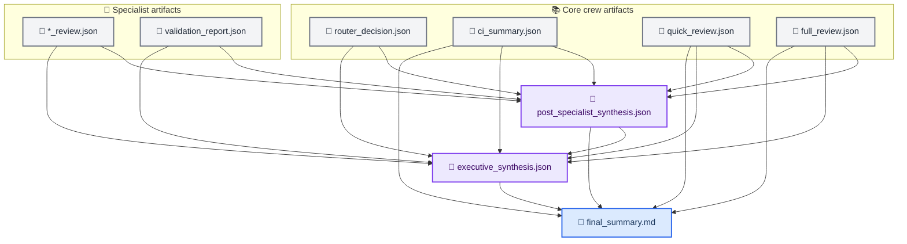

# CrewAI Code Review System

> Multi-agent AI code review for GitHub pull requests. 27 specialized agents across 14 crews covering security, legal, finance, documentation, marketing, science, government compliance, and business strategy.

> **For AI agents working in this repo:** start with [../AGENTS.md](../AGENTS.md) before using this subsystem guide.

---

## 📋 Overview

This directory contains a CrewAI-powered code review system that runs automatically on pull requests via GitHub Actions or locally via `./scripts/ci-local.sh --review`.

**System at a glance:**

| Metric                    | Value                                                                                                    |
| ------------------------- | -------------------------------------------------------------------------------------------------------- |
| **Agents**                | 27 specialized agents                                                                                    |
| **Crews**                 | 14 review crews                                                                                          |
| **Tasks**                 | 29 sequential tasks                                                                                      |
| **Specialist domains**    | 10 (security, legal, finance, docs, agentic, marketing, science, government, strategy, data engineering) |
| **Multi-agent pipelines** | Legal (4 agents), Marketing (3), Strategy (3), Full Review (3), Quick Review (3), CI Log Analysis (3)    |
| **Output**                | Structured JSON per crew + markdown summary                                                              |

---

## 🏗️ Architecture

### Crew pipeline

```mermaid
flowchart LR
accTitle: CrewAI orchestration with synthesis stages
accDescr: Execution order from router through review crews, specialist crews, post-specialist synthesis, final summary, and terminal executive synthesis.

    router([🧭 Router]) --> ci[📊 CI log analysis]
    ci --> quick[⚡ Quick review]
    quick --> full_gate{Run full review?}
    full_gate -->|Yes| full[🔍 Full review]
    full_gate -->|No| specialist_gate
    full --> specialist_gate{Run specialist crews?}
    specialist_gate -->|Yes| specialists[🔬 Specialist crews]
    specialist_gate -->|No| suppressions
    specialists --> suppressions[🧠 Apply memory suppressions]
    suppressions --> post_synth[🧩 Post-specialist synthesis]
    post_synth --> final_summary[📋 Final summary]
    final_summary --> exec_synth[🧠 Executive synthesis]
    exec_synth --> final_md[📝 Programmatic final_summary.md]

    classDef primary fill:#dbeafe,stroke:#2563eb,stroke-width:2px,color:#1e3a5f
    classDef success fill:#dcfce7,stroke:#16a34a,stroke-width:2px,color:#14532d
    classDef neutral fill:#f3f4f6,stroke:#6b7280,stroke-width:2px,color:#1f2937

    class router,ci,quick,full,specialists primary
    class post_synth,final_summary,exec_synth success
    class final_md,suppressions neutral
```



### Synthesis timing and scope



**Always-run crews:** Router, CI Log Analysis, Quick Review, Final Summary

**Label-triggered crews:** Full Review, and any of the 10 specialist crews

**`crewai:full-review` label:** Enables full review plus broader specialist selection (mode-aware)

**`crewai:complete-full-review` label:** Runs ALL specialist crews with complete-repository scope

### Flow compatibility matrix

| Flow mode                                       | Core crews | Specialist crews | Post-specialist synthesis | Executive synthesis | Final markdown assembly |
| ----------------------------------------------- | ---------- | ---------------- | ------------------------- | ------------------- | ----------------------- |
| Quick-only (default labels absent)              | ✅         | Optional (auto)  | ✅                        | ✅                  | ✅                      |
| Full review (explicit label)                    | ✅         | Optional/broader | ✅                        | ✅                  | ✅                      |
| Complete full review (all domains)              | ✅         | ✅ all 10        | ✅                        | ✅                  | ✅                      |
| Specialist-only (explicit specialist label set) | ✅         | ✅ selected      | ✅                        | ✅                  | ✅                      |

### Specialist crews

| Crew             | Agents                                             | Label                     | Domain                                                                                        |
| ---------------- | -------------------------------------------------- | ------------------------- | --------------------------------------------------------------------------------------------- |
| Security         | 1 (owasp_sentinel)                                 | `crewai:security`         | OWASP-grade vulnerability analysis                                                            |
| Legal            | 4 (license → US regulatory → intl trade → privacy) | `crewai:legal`            | OSS licenses, 50-state US law, export controls, global privacy (GDPR, CCPA, LGPD, PIPL, etc.) |
| Finance          | 1 (revenue_auditor)                                | `crewai:finance`          | Billing logic, payment flows, SOX, PCI-DSS                                                    |
| Documentation    | 1 (docs_curator)                                   | `crewai:docs`             | README accuracy, API docs, code examples                                                      |
| Agentic          | 1 (agentic_steward)                                | `crewai:agentic`          | AGENTS.md compliance, convention enforcement                                                  |
| Marketing        | 3 (brand → global GTM → compliance)                | `crewai:marketing`        | Copy quality, i18n, regional advertising law, dark patterns                                   |
| Science          | 1 (repro_scientist)                                | `crewai:science`          | Reproducibility, statistical rigor, data leakage                                              |
| Government       | 1 (public_sector_compliance)                       | `crewai:government`       | WCAG 2.1 AA, Section 508, audit trails                                                        |
| Strategy         | 3 (impact → expansion → competitive)               | `crewai:strategy`         | Business impact, global expansion readiness, competitive positioning                          |
| Data Engineering | 1 (data_engineering_reviewer)                      | `crewai:data-engineering` | SQL/schema/migrations, ETL/ELT reliability, data contracts                                    |

---

## 📁 Directory structure

```
.crewai/
├── README.md                 # This file — subsystem overview
├── main.py                   # CLI entrypoint
├── pyproject.toml            # Python dependencies
├── pytest.ini               # Test configuration
├── .env.example             # Environment template
│
├── config/                  # Agent and task definitions
│   ├── agents.yaml          # 27 agent definitions
│   └── tasks/               # 29 task definitions
│       ├── agentic_review_tasks.yaml
│       ├── ci_log_analysis_tasks.yaml
│       ├── data_engineering_review_tasks.yaml
│       ├── documentation_review_tasks.yaml
│       ├── finance_review_tasks.yaml
│       ├── final_summary_tasks.yaml
│       ├── full_review_tasks.yaml
│       ├── government_review_tasks.yaml
│       ├── legal_review_tasks.yaml
│       ├── marketing_review_tasks.yaml
│       ├── quick_review_tasks.yaml
│       ├── router_tasks.yaml
│       ├── science_review_tasks.yaml
│       ├── security_review_tasks.yaml
│       └── strategy_review_tasks.yaml
│
├── crews/                   # Crew implementations (14 crews)
│   ├── agentic_review_crew.py
│   ├── ci_log_analysis_crew.py
│   ├── data_engineering_review_crew.py
│   ├── documentation_review_crew.py
│   ├── finance_review_crew.py
│   ├── final_summary_crew.py
│   ├── full_review_crew.py
│   ├── government_review_crew.py
│   ├── legal_review_crew.py
│   ├── marketing_review_crew.py
│   ├── quick_review_crew.py
│   ├── router_crew.py
│   ├── science_review_crew.py
│   ├── security_review_crew.py
│   └── strategy_review_crew.py
│
├── tools/                   # Shared tools
│   ├── ci_output_parser_tool.py
│   ├── ci_tools.py
│   ├── commit_summarizer_tool.py
│   ├── cost_tracker.py
│   ├── diff_parser.py
│   ├── github_tools.py
│   ├── memory_cli.py
│   ├── memory_manager.py
│   ├── pr_metadata_tool.py
│   ├── related_files_tool.py
│   └── workspace_tool.py
│
├── utils/                   # Utility modules
│   ├── model_config.py
│   └── specialist_output.py
│
├── memory/                  # Persistent review memory
│   ├── memory.json
│   ├── suppressions.json
│   └── sql/
│       └── memory_seed.sql
│
├── adr/                     # Architecture decision records
│   ├── README.md
│   └── ADR-001 ... ADR-007
│
├── workspace/               # Runtime outputs (gitignored)
└── tests/                   # Test suite
    ├── test_cost_tracker.py
    ├── test_github_tools.py
    ├── test_memory_cli.py
    ├── test_memory_manager.py
    ├── test_pr_metadata_tool.py
    ├── test_specialist_output.py
    ├── test_specialist_quality.py
    ├── test_workspace_tool.py
    └── ...
```

---

## ⚡ Quick start

### Local review

```bash
# From repo root
./scripts/ci-local.sh --review
```

The script prefers `NVIDIA_API_KEY` (Kimi K2.5 on NVIDIA NIM) and falls back to `OPENROUTER_API_KEY` when NVIDIA is unavailable. It cleans the workspace, generates a diff, and runs the full crew pipeline.

### GitHub Actions

1. Add `NVIDIA_API_KEY` to repository secrets (preferred) and optionally `OPENROUTER_API_KEY` as fallback
2. Push a PR — the review runs automatically
3. Add labels to trigger specialist crews (e.g., `crewai:security`, `crewai:legal`)
4. Add `crewai:full-review` to run ALL specialist crews

---

## ⚙️ Configuration

### 🧭 Architecture decisions

CrewAI-specific implementation decisions are tracked in `.crewai/adr/`.

- Subsystem-local decisions stay in `.crewai/adr/`
- Cross-repo decisions must also be mirrored in `agentic/adr/`
- Superseded decisions are retained and marked superseded (never deleted)

See `.crewai/adr/README.md` for the local index.

### Environment variables

Copy `.env.example` to `.env` and set:

| Variable                 | Required | Description                                                        |
| ------------------------ | -------- | ------------------------------------------------------------------ |
| `OPENROUTER_API_KEY`     | Required | API key for CrewAI runtime calls (OpenRouter primary path)         |
| `CREWAI_MODEL`           | No       | Override default model (default: configured in `model_config.py`)  |
| `MEM0_BACKEND`           | No       | `local` (default), `cloud`, or `self-hosted`                       |
| `USE_MEM0_CLOUD`         | No       | Legacy toggle for cloud mode when `MEM0_BACKEND` is not set        |
| `USE_MEM0_SELF_HOSTED`   | No       | Legacy toggle for self-hosted mode when `MEM0_BACKEND` is not set  |
| `MEM0_API_KEY`           | No       | Required for mem0 cloud; optional for some self-hosted deployments |
| `MEM0_SELF_HOSTED_URL`   | No       | Base URL for self-hosted mem0 API                                  |
| `MEM0_BASE_URL`          | No       | Optional override for cloud/self-hosted mem0 endpoint              |
| `MEMORY_OPTIMIZER_MODEL` | No       | LLM model used for memory compression during `--add-memory`        |

### Model selection

Edit `utils/model_config.py` to change model behavior. CrewAI runtime defaults to OpenRouter and can be overridden with explicit model configuration.

### Customizing agents

Edit `config/agents.yaml` — each agent has `role`, `goal`, and `backstory` fields that control its behavior.

### Customizing tasks

Edit the relevant YAML in `config/tasks/` — each task has `description` (the agent's instructions) and `expected_output`.

### Persistent review memory

Use `scripts/memory.sh` to manage review memory that persists across runs:

```bash
# List learned memories
./scripts/memory.sh --list-memories

# Add a new learned memory
./scripts/memory.sh --add-memory "Example placeholders in .env.example are acceptable when clearly fake" --source maintainer-policy --confidence 1.0

# Add memory without LLM optimization
./scripts/memory.sh --add-memory "Use strict schema checks for specialist outputs" --no-optimize

# List active suppressions
./scripts/memory.sh --list-suppressions

# Add a suppression rule
./scripts/memory.sh --add-suppression "placeholder api keys and tokens" --reason "Template placeholders are expected" --file-glob "*.env.example"

# Show context injected into review prompts
./scripts/memory.sh --show-context

# Compact memory (dedupe + trim trends)
./scripts/memory.sh --compact-memory --max-trend-entries 50

# Preview compaction only
./scripts/memory.sh --compact-memory --dry-run --json

# Export SQL seed (text, tracked)
./scripts/memory.sh --export-sql

# Build runtime SQLite DB from SQL seed (local-only)
./scripts/memory.sh --materialize-sqlite

# Print backend mode and storage paths
./scripts/memory.sh --backend-status
```

Memory backend behavior:

- Local JSON (`.crewai/memory/memory.json`, `.crewai/memory/suppressions.json`) is the default.
- SQL seed export is maintained at `.crewai/memory/sql/memory_seed.sql` (text, repo-safe).
- Optional runtime SQLite materialization is supported for local CI/Actions bootstrap and should not be committed.
- mem0 Cloud is optional via `MEM0_BACKEND=cloud` (or `USE_MEM0_CLOUD=true`) with `MEM0_API_KEY`.
- mem0 self-hosted is optional via `MEM0_BACKEND=self-hosted` (or `USE_MEM0_SELF_HOSTED=true`) with `MEM0_SELF_HOSTED_URL`.

---

## 🔬 Testing

```bash
cd .crewai
python3 -m pytest tests/ -v
```

104 tests covering:

- Workspace tool operations
- Cost tracker functionality
- GitHub tools and PR metadata
- CI output parsing
- Specialist crew registry (10 crews, labels, prefixes, output files)
- Output schema validation (severity counts, findings format, ID prefixes)
- Autodetect heuristics (file pattern matching for crew suggestions)
- Crew integrity (all 14 crew files compile, reference valid agents and tasks)
- Cross-reference validation (27 agents ↔ 29 tasks ↔ 14 YAML files)

---

## 📊 Output files

Each crew writes structured JSON to the workspace directory. The final summary crew reads all outputs and produces `final_summary.md`.

Specialist behavior is explicitly non-simulated:

- Specialists must review real branch changes only.
- If no relevant changed files are detected for a specialist domain, that specialist writes a valid "not applicable" result with zero findings.
- Simulated/hypothetical findings are treated as low-signal and suppressed by quality filters.

| File                                | Written by       | Schema                                                     |
| ----------------------------------- | ---------------- | ---------------------------------------------------------- |
| `router_decision.json`              | Router           | Workflows, specialist crews, autodetect suggestions        |
| `ci_summary.json`                   | CI Log Analysis  | Failed jobs, error evidence, fix recommendations           |
| `quick_review.json`                 | Quick Review     | Critical issues, warnings, suggestions                     |
| `full_review.json`                  | Full Review      | Architecture, security, performance, testing findings      |
| `post_specialist_synthesis.json`    | Orchestrator     | Consolidated specialist rollup and priority extraction     |
| `executive_synthesis.json`          | Orchestrator LLM | Terminal executive synthesis from all artifacts            |
| `security_review.json`              | Security         | OWASP findings with SEC- prefixed IDs                      |
| `legal_review.json`                 | Legal            | Multi-jurisdiction findings with LEGAL- prefixed IDs       |
| `finance_review.json`               | Finance          | Financial control findings with FIN- prefixed IDs          |
| `documentation_review.json`         | Documentation    | Doc quality findings with DOC- prefixed IDs                |
| `agentic_consistency_review.json`   | Agentic          | Convention findings with AGENT- prefixed IDs               |
| `marketing_review.json`             | Marketing        | Copy and GTM findings with MKT- prefixed IDs               |
| `science_review.json`               | Science          | Reproducibility findings with SCI- prefixed IDs            |
| `government_regulatory_review.json` | Government       | Accessibility findings with GOV- prefixed IDs              |
| `strategic_review.json`             | Strategy         | Business impact findings with STRAT- prefixed IDs          |
| `data_engineering_review.json`      | Data Engineering | Data platform findings with DATA- prefixed IDs             |
| `final_summary.md`                  | Final assembler  | Programmatic markdown rollup guided by synthesis artifacts |

### Standardized specialist output schema

All 10 specialist crews write the same JSON schema:

```json
{
  "summary": "1-3 sentences: what matters most and why.",
  "severity_counts": { "critical": 0, "high": 0, "medium": 0, "low": 0, "info": 0 },
  "findings": [
    {
      "id": "PREFIX-001",
      "title": "Short title",
      "severity": "critical|high|medium|low|info",
      "file": "path/to/file",
      "description": "What changed and why it matters",
      "recommendation": "Concrete fix or next step",
      "verification": "How to prove the fix works"
    }
  ]
}
```

---

## 🔒 Security

- `NVIDIA_API_KEY` preferred for CrewAI runs; `OPENROUTER_API_KEY` supported as fallback
- `OPENROUTER_API_KEY` is required for CrewAI runtime calls
- `GITHUB_TOKEN` automatically provided by GitHub Actions with minimal permissions
- No secrets logged or exposed in output
- Local memory (`memory.json`) stays in repo, gitignored from workspace artifacts
- Local/non-PR runs skip memory trend writes to keep `memory.json` focused on real PR history
- mem0 cloud integration is completely off by default
- Placeholder values in `*.env.example` are acceptable for documentation templates; only real credential leakage should be flagged.
