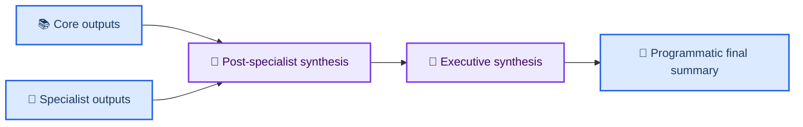

# ADR-007: Terminal Executive Synthesis Stage

| Field               | Value                                                      |
| ------------------- | ---------------------------------------------------------- |
| **Status**          | Accepted                                                   |
| **Date**            | 2026-02-15                                                 |
| **Decision makers** | Repo maintainers                                           |
| **Consulted**       | AI agents (review reliability and summary quality)         |
| **Informed**        | Contributors running local and GitHub Actions review flows |

---

## 📋 Context

The subsystem already included full-review synthesis and specialist outputs, but the final executive framing could be assembled before a true terminal LLM consolidation over all generated artifacts.

That caused confusion in cost tracing and summary ownership because the last LLM call could belong to a specialist/refine pass rather than a final cross-artifact synthesis stage.

---

## 🎯 Decision

1. Add a terminal executive-synthesis stage that runs after all review crews and specialist outputs are available.
2. Persist an explicit `executive_synthesis.json` artifact with executive summary lines, priority actions, and summary guidance.
3. Keep final markdown assembly deterministic/programmatic, but let it consume executive synthesis output when present.
4. Keep behavior generic across flow modes (quick-only, full-review, specialist subsets, complete-full-review).

---

## ⚡ Consequences

### Positive

- Last synthesis call reflects end-of-pipeline consolidation.
- Executive summary and top actions use all available review artifacts.
- Cost table ordering is easier to interpret for operators.

### Negative

- Adds one more LLM call in review runs.
- Requires maintaining schema and context shaping for executive synthesis.

---

## ✅ Guardrails

- Treat `executive_synthesis.json` as advisory input; deterministic fallback remains authoritative.
- Never skip deterministic fallback assembly when deep review artifacts exist.
- Keep synthesis robust when some crews are absent or skipped.

---

## 📋 Evidence in code

- `.crewai/main.py` (terminal synthesis stage, context builder, fallback integration)
- `.crewai/config/tasks/final_summary_tasks.yaml` (explicit executive-synthesis artifact input)
- `.crewai/README.md` (updated orchestration and artifact-flow diagrams)

---

## 🔗 References

- [Subsystem ADR index](./README.md)
- [Issue-00000003](../../docs/project/issues/issue-00000003-local-review-context-pack-and-resilience.md)

---

_Last updated: 2026-02-15 13:32 EST_
