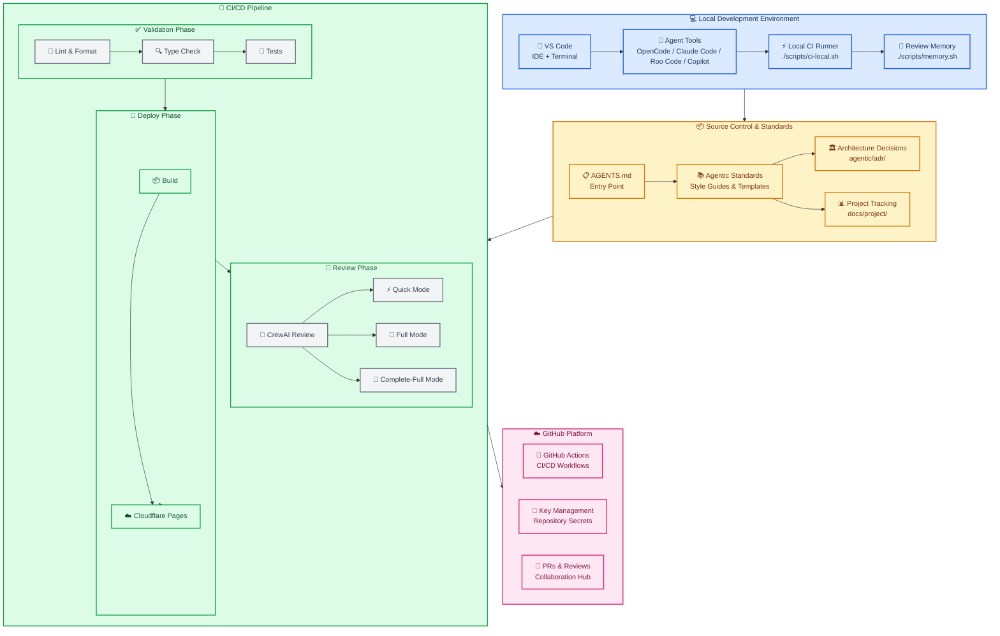
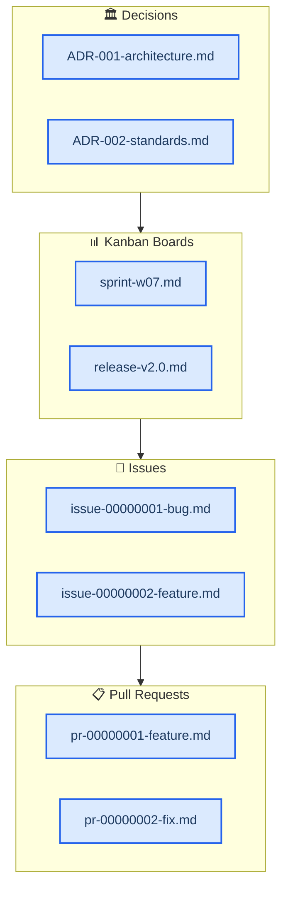
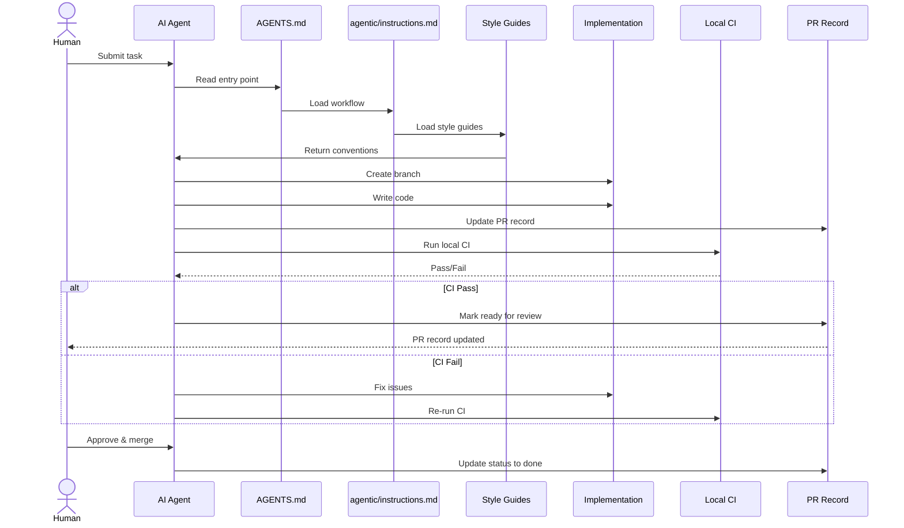
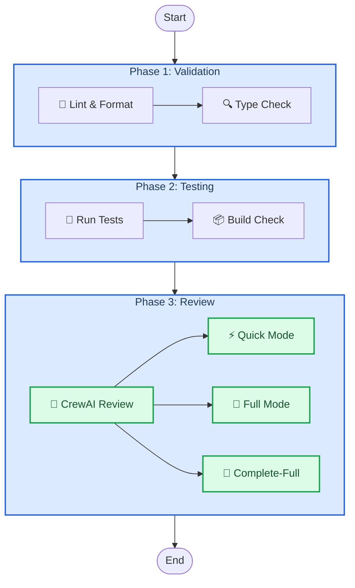
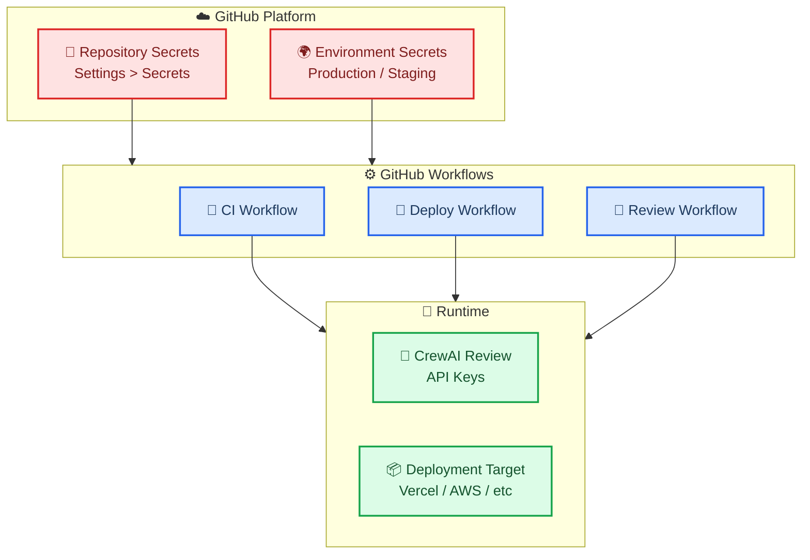

# agent-project: AGENTS.md-First Agentic Coding Template

> **A production-ready template for teams shipping with AI coding agents.**

`agent-project` is a practical starter template built around an `AGENTS.md` entrypoint and an "everything as code" workflow. Standards, plans, PR records, issues, boards, and review policies live in the repository as versioned markdown files—accessible to both humans and AI agents.

**The philosophy is simple:** Point any agent at `AGENTS.md`, and it knows exactly how to work in your repo.

---

## 🏗️ System Architecture

_The template provides a complete development workflow from local development through CI/CD deployment, with AI-powered code reviews at every stage:_



---

## 🚀 Quickstart

Get up and running in minutes:

```bash
# Clone the template
git clone https://github.com/borealBytes/agent-project.git
cd agent-project

# Install dependencies
pnpm install

# Run local CI to validate everything works
./scripts/ci-local.sh
```

**Agent review modes:**

```bash
# Quick review - fast triage for daily iteration
./scripts/ci-local.sh --review

# Full review - deeper analysis with specialists
./scripts/ci-local.sh --full-review --step review

# Complete-full review - maximum coverage for critical changes
./scripts/ci-local.sh --complete-full-review --step review
```

---

## 🎯 Who This Is For

This template is designed for teams using any AI coding agent:

| Tool                            | How It Works                                                                   |
| ------------------------------- | ------------------------------------------------------------------------------ |
| **OpenCode**                    | Reads `AGENTS.md` at startup, follows instructions for PRs, issues, and kanban |
| **Claude Code**                 | Ingests repo rules from `AGENTS.md`, applies conventions automatically         |
| **Roo Code**                    | Uses `AGENTS.md` as system context for all operations                          |
| **GitHub Copilot**              | References `AGENTS.md` for code style and conventions                          |
| **Perplexity/Other Web Agents** | Point to `AGENTS.md` URL as entrypoint                                         |

**Perfect for teams that want:**

- ✅ Auditable, repo-native process standards (not UI-only metadata)
- ✅ AI agents that follow the same rules as humans
- ✅ Versioned project tracking in git
- ✅ Local-first CI with optional GitHub Actions integration

---

## 📋 Everything as Code

This template treats process records as first-class code artifacts:



**Why this matters:**

- **Portable:** Your project history travels with the repo
- **Versioned:** Git tracks every change with attribution
- **Accessible:** Both humans and agents read the same files
- **Offline:** No dependency on external platforms

---

## 🔍 Agent Workflow

_How agents work with this template from task to completion:_



---

## ⚡ Local CI Pipeline

_The local CI runner validates code before it reaches GitHub:_



### Review Modes Explained

| Mode              | Command                                                      | What It Does                     | When to Use            |
| ----------------- | ------------------------------------------------------------ | -------------------------------- | ---------------------- |
| **Quick**         | `./scripts/ci-local.sh --review`                             | Fast triage-oriented review      | Day-to-day iteration   |
| **Full**          | `./scripts/ci-local.sh --full-review --step review`          | Deeper synthesis + specialists   | Risky or broad changes |
| **Complete-Full** | `./scripts/ci-local.sh --complete-full-review --step review` | All specialists, full-repo scope | Pre-merge hardening    |

**Layered assurance:** Speed when you need flow, depth when you need confidence, complete coverage when touching multiple risk domains.

---

## 🏛️ Project Structure

_The monorepo layout supports polyglot development:_

```mermaid
graph TD
accTitle: Repository Structure
accDescr: Visual overview of the repository directory structure.

root["📁 agent-project/"] --> agentic["📁 agentic/<br/>Agent Framework"]
root --> crewai["📁 .crewai/<br/>Review System"]
root --> apps["📁 apps/<br/>Deployable Apps"]
root --> services["📁 services/<br/>Background Services"]
root --> packages["📁 packages/<br/>Shared Libraries"]
root --> data["📁 data/sql/<br/>Database Schemas"]
root --> docs["📁 docs/<br/>Documentation"]
root --> scripts["📁 scripts/<br/>CI Scripts"]

agentic --> agf1["instructions.md"]
agentic --> agf2["AGENTS.md"]
agentic --> agf3["adr/"]
agentic --> agf4["markdown_templates/"]

crewai --> crw1["crews/"]
crewai --> crw2["config/"]
crewai --> crw3["adr/"]

apps --> web["web/<br/>Next.js Site"]
apps --> api["api/<br/>API Server"]

docs --> pr["project/pr/<br/>PR Records"]
docs --> issues["project/issues/<br/>Issue Records"]
docs --> kanban["project/kanban/<br/>Kanban Boards"]

classDef root fill:#fee2e2,stroke:#dc2626,stroke-width:3px,color:#7f1d1d
classDef framework fill:#dbeafe,stroke:#2563eb,stroke-width:2px,color:#1e3a5f
classDef workspace fill:#dcfce7,stroke:#16a34a,stroke-width:2px,color:#14532d
classDef docs fill:#fef3c7,stroke:#d97706,stroke-width:2px,color:#78350f

class root root
class agentic,crewai framework
class apps,services,packages,data workspace
class docs,scripts docs
```



### Key Directories

| Directory       | Purpose                       | Key Files                                    |
| --------------- | ----------------------------- | -------------------------------------------- |
| `agentic/`      | Agent framework and standards | `AGENTS.md`, `instructions.md`, style guides |
| `.crewai/`      | CrewAI review system          | Agent definitions, task contracts, crews     |
| `apps/`         | Deployable applications       | `web/`, `api/`, `cli/`                       |
| `services/`     | Background services/workers   | Long-running processes                       |
| `packages/`     | Shared libraries/modules      | Reusable code                                |
| `data/sql/`     | Database schemas/migrations   | SQL files                                    |
| `docs/project/` | Project tracking              | PRs, issues, kanban boards                   |
| `scripts/`      | CI and utility scripts        | `ci-local.sh`, `memory.sh`                   |

---

## 🔐 Key Management

**GitHub Actions secrets are cleanly managed:**



**Required Secrets:**

- `OPENROUTER_API_KEY` - For CrewAI reviews (or `NVIDIA_API_KEY` for NVIDIA NIM)
- Deployment tokens for your hosting platform (Vercel, AWS, etc.)

---

## 🎓 Usage Workflows

### Workflow 1: Web-Based Agent

Perfect for Perplexity, Claude web, or other hosted agents:

1. **Point the agent to `AGENTS.md`** as the entrypoint
2. **Connect the repository** (or provide diffs)
3. **Work in branches** with PR records in `docs/project/pr/`
4. **Track progress** in kanban boards

### Workflow 2: Local IDE Agent

For OpenCode, Roo Code, Claude Code, Copilot:

1. **Clone locally** and open in your IDE
2. **Agent reads `AGENTS.md`** automatically
3. **Run local CI** before committing
4. **Push to GitHub** for team review

### Workflow 3: Hybrid Mode

Best of both worlds:

1. **Local development** with agent assistance
2. **Local CI validation** before push
3. **GitHub Actions** for team CI/CD
4. **CrewAI review** for quality gates

---

## 🛠️ Customization

### Adding Specialists

Specialists are configured in `.crewai/` and can be adapted to your domain:

```yaml
# .crewai/config/agents.yaml
security_specialist:
  role: Security Specialist
  goal: Identify security vulnerabilities
  backstory: Expert in application security...
```

### Custom Standards

Add organization-specific context:

```markdown
# agentic/custom-instructions.md

## Our Team Standards

- We use tabs, not spaces
- Maximum line length: 100 characters
- Required reviewers: 2 for all PRs
```

---

## 🌾 Final project dashboard

The final project dashboard is implemented as a Streamlit app titled:

`East New Mexico Wheat Production System`

Run it locally:

```bash
pip install -r src/apps/final_project_dashboard/requirements.txt
streamlit run src/apps/final_project_dashboard/app.py
```

Project files:

- App: `src/apps/final_project_dashboard/app.py`
- App docs: `src/apps/final_project_dashboard/README.md`
- AI usage summary: `docs/ai_docs.md`

---

## 📖 Entry Points

Start here based on what you're doing:

| If you want to...            | Start here                                                   |
| ---------------------------- | ------------------------------------------------------------ |
| **Use an agent**             | [`AGENTS.md`](AGENTS.md)                                     |
| **Understand the framework** | [`agentic/README.md`](agentic/README.md)                     |
| **Customize CI/CD**          | [`.github/workflows/README.md`](.github/workflows/README.md) |
| **Add specialists**          | [`.crewai/README.md`](.crewai/README.md)                     |
| **Create a PR**              | [`docs/project/pr/`](docs/project/pr/)                       |
| **Track work**               | [`docs/project/kanban/`](docs/project/kanban/)               |
| **Document decisions**       | [`agentic/adr/`](agentic/adr/)                               |
| **Run scripts**              | [`scripts/README.md`](scripts/README.md)                     |

---

## 📚 Additional Resources

- **License:** Apache-2.0 (see [`LICENSE`](LICENSE) and [`NOTICE`](NOTICE))
- **Author:** Clayton Young ([@borealBytes](https://github.com/borealBytes)), Superior Byte Works, LLC
- **Contributing:** See [`CONTRIBUTING.md`](CONTRIBUTING.md)

---

<p align="center">
  <strong>Built for agents. Designed for humans. Versioned in git.</strong>
</p>
