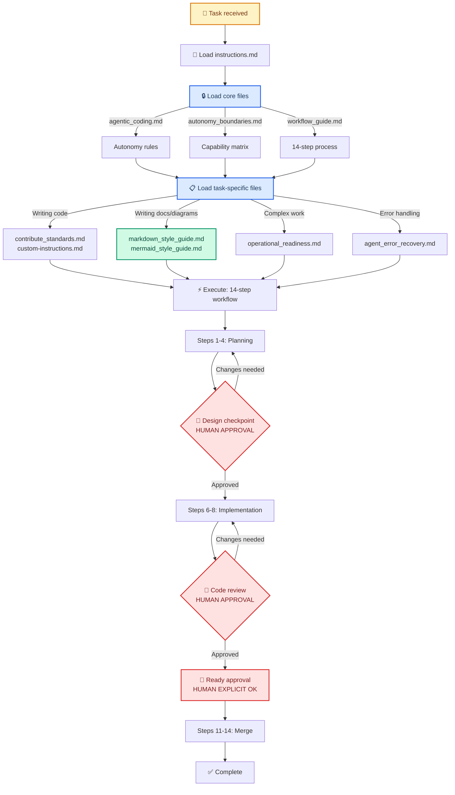

# Agentic Development Framework

> **For AI agents:** Start at [../AGENTS.md](../AGENTS.md) first, then load [instructions.md](instructions.md). `AGENTS.md` is the repo-wide entrypoint and this directory is the operating framework it routes you into.
>
> **For humans:** This framework defines how AI agents work in your repo — autonomy boundaries, workflow checkpoints, documentation standards, and project management conventions. Review and customize to match your team's needs.

**Author:** Clayton Young ([@borealBytes](https://github.com/borealBytes)), Superior Byte Works, LLC

---

## 🔄 Agent interaction architecture



---

## 📋 Quick navigation

### Core files (read first — every task)

| #   | File                                                 | Purpose                                              |
| --- | ---------------------------------------------------- | ---------------------------------------------------- |
| 1   | **[instructions.md](instructions.md)**               | Agent entry point — what to read and when            |
| 2   | **[agentic_coding.md](agentic_coding.md)**           | CAN / MUST escalate / NEVER rules + 14-step workflow |
| 3   | **[autonomy_boundaries.md](autonomy_boundaries.md)** | Capability matrix and escalation procedures          |
| 4   | **[workflow_guide.md](workflow_guide.md)**           | 14-step transparent workflow with human checkpoints  |

### Task-specific files (load based on work type)

| #   | File                                                   | When to load                                                  |
| --- | ------------------------------------------------------ | ------------------------------------------------------------- |
| 5   | **[contribute_standards.md](contribute_standards.md)** | Writing code — commit standards, PR conventions, code style   |
| 6   | **[custom-instructions.md](custom-instructions.md)**   | Writing code — project-specific rules (customize per project) |

### Operational files (load for complex work)

| #   | File                                                               | When to load                                      |
| --- | ------------------------------------------------------------------ | ------------------------------------------------- |
| 7   | **[operational_readiness.md](operational_readiness.md)**           | System constraints, rate limits, resource budgets |
| 8   | **[context_budget_guide.md](context_budget_guide.md)**             | Token management, session planning                |
| 9   | **[idempotent_design_patterns.md](idempotent_design_patterns.md)** | Writing or reviewing automation scripts           |

### Error and recovery

| #   | File                                                   | When to load                                          |
| --- | ------------------------------------------------------ | ----------------------------------------------------- |
| 10  | **[agent_error_recovery.md](agent_error_recovery.md)** | When errors occur — 9 categories with recovery steps  |
| 11  | **[file_organization.md](file_organization.md)**       | When confused about file locations or source of truth |

### Style guides and templates

| Resource                                               | Purpose                                                           |
| ------------------------------------------------------ | ----------------------------------------------------------------- |
| **[markdown_style_guide.md](markdown_style_guide.md)** | Formatting rules for ALL markdown documents                       |
| **[mermaid_style_guide.md](mermaid_style_guide.md)**   | Standards for ALL Mermaid diagrams                                |
| **[markdown_templates/](markdown_templates/)**         | 9 document templates (PR, issue, kanban, ADR, presentation, etc.) |
| **[mermaid_diagrams/](mermaid_diagrams/)**             | 23 diagram type guides + complex examples                         |

### Architecture decision records

| ADR                                                                 | Decision                                                   |
| ------------------------------------------------------------------- | ---------------------------------------------------------- |
| [ADR-001](adr/ADR-001-agent-optimized-documentation-system.md)      | Agent-optimized documentation system                       |
| [ADR-002](adr/ADR-002-mermaid-diagram-standards.md)                 | Mermaid diagram standards                                  |
| [ADR-003](adr/ADR-003-everything-is-code.md)                        | Everything is Code — project management as committed files |
| [ADR-004](adr/ADR-004-task-completion-source-of-truth-sync.md)      | Mandatory source-of-truth sync at task completion          |
| [ADR-005](adr/ADR-005-polyglot-monorepo-workspace-layout.md)        | Polyglot monorepo workspace layout                         |
| [ADR-006](adr/ADR-006-federated-adr-governance.md)                  | Federated ADR governance for global + subsystem decisions  |
| [ADR-007](adr/ADR-007-monorepo-foundation-and-decision-baseline.md) | Baseline monorepo decision map and operating foundation    |
| [ADR-008](adr/ADR-008-persistent-review-memory-governance.md)       | Persistent review memory governance                        |

Subsystems may also keep local ADR logs (for example `.crewai/adr/`) for implementation decisions that do not affect the full monorepo.

### Project management (Everything is Code)

| Directory              | Contents              | Naming pattern                              |
| ---------------------- | --------------------- | ------------------------------------------- |
| `docs/project/pr/`     | Pull request records  | `pr-NNNNNNNN-short-description.md`          |
| `docs/project/issues/` | Issue records         | `issue-NNNNNNNN-short-description.md`       |
| `docs/project/kanban/` | Sprint/project boards | `{scope}-{identifier}-short-description.md` |

---

## 🎯 The 14-step workflow

From [agentic_coding.md](agentic_coding.md):

```text
 1. Agent reads instructions.md + agentic_coding.md
 2. Agent reads autonomy_boundaries.md
 3. Agent understands task
 4. Agent creates branch with design document

 5. └─ 🚨 CHECKPOINT 1: Design review (HUMAN)
         ↓ Approved? Continue : Request changes

 6. Agent writes code & tests
 7. Agent commits with Scoped Conventional Commits
 8. Agent creates/updates PR with progress checklist

 9. └─ 🚨 CHECKPOINT 2: Code review (HUMAN)
         ↓ Approved? Continue : Request changes

10. └─ 🚨 CHECKPOINT 3: Status approval (HUMAN EXPLICIT)
          ↓ Confirms "Ready for Review"

11. CI runs (format, lint, test, build)
12. Human merges PR
13. ✅ Done
```

**Key principle:** 3 explicit human checkpoints ensure quality without blocking agent autonomy.

---

## 🤔 Frequently asked questions

**Q: Where do I start?**
Read [instructions.md](instructions.md), then [agentic_coding.md](agentic_coding.md), then [workflow_guide.md](workflow_guide.md).

**Q: What can I do autonomously?**
See the "Agent CAN" section in [agentic_coding.md](agentic_coding.md) and the full matrix in [autonomy_boundaries.md](autonomy_boundaries.md).

**Q: What requires human approval?**
See the "Agent MUST Escalate" section in [agentic_coding.md](agentic_coding.md).

**Q: What should I never do?**
See the "Agent NEVER" section in [agentic_coding.md](agentic_coding.md) — merge, deploy, access secrets, force-push.

**Q: How do I write documentation?**
Follow [markdown_style_guide.md](markdown_style_guide.md) for formatting and [mermaid_style_guide.md](mermaid_style_guide.md) for diagrams. Use templates from [markdown_templates/](markdown_templates/).

**Q: How do I create a diagram?**
Read [mermaid_style_guide.md](mermaid_style_guide.md) for the core rules, then open the specific diagram type file in [mermaid_diagrams/](mermaid_diagrams/).

**Q: Where do PRs, issues, and boards live?**
As markdown files in `docs/`. See [ADR-003](adr/ADR-003-everything-is-code.md) and the [Everything is Code](markdown_style_guide.md#-everything-is-code) section of the style guide.

**Q: What if I hit an error?**
See [agent_error_recovery.md](agent_error_recovery.md) — 9 categories with recovery steps.

**Q: How do I manage context/tokens?**
See [context_budget_guide.md](context_budget_guide.md) for session planning strategies.

---

## 📊 Status

| Field                | Value                                           |
| -------------------- | ----------------------------------------------- |
| **Template version** | 1.0                                             |
| **Last updated**     | 2026-02-13                                      |
| **Files**            | 12 core files + style guides + templates + ADRs |
| **Status**           | Production-ready ✅                             |

---

_This is a living document. As standards evolve, these files are updated. All changes tracked in git history._
