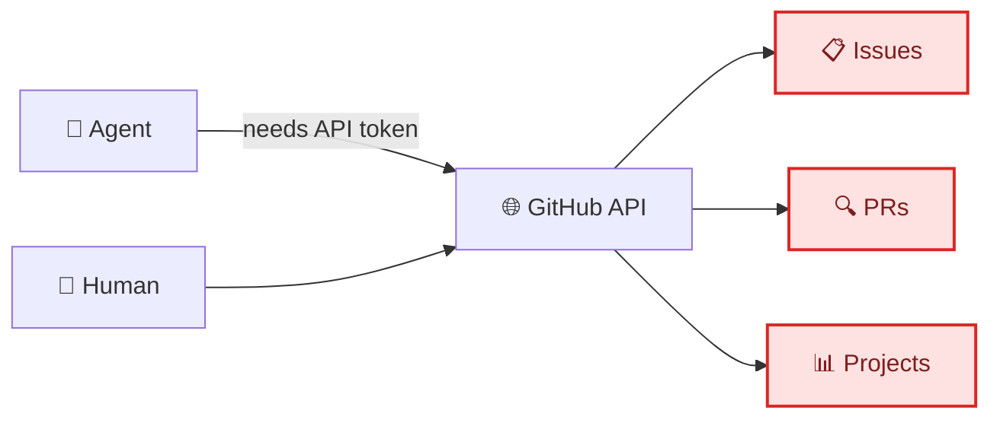
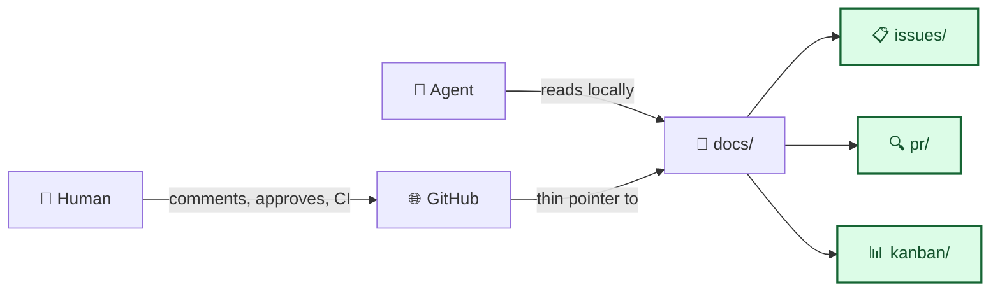

# ADR-003: Everything is Code — Project Management as Committed Files

| Field               | Value                                            |
| ------------------- | ------------------------------------------------ |
| **Status**          | Accepted                                         |
| **Date**            | 2026-02-13                                       |
| **Decision makers** | Clayton Young                                    |
| **Consulted**       | AI agents (during template design)               |
| **Informed**        | All contributors and agents working in this repo |

---

## 📋 Context

### What prompted this decision?

AI agents working in this repo can read any file in the repository instantly — but they can't access GitHub Issues, GitHub PRs, or GitHub Projects without API tokens, rate limits, and platform-specific queries. When an agent needs to understand "what are the open issues?" or "what did PR #47 change?", it has to call the GitHub API (if it even has access) rather than just reading a file.

Meanwhile, project management data locked in GitHub's UI is:

- **Invisible to agents** without explicit API access
- **Non-portable** — if we move to GitLab or Gitea, all issue history and PR context is lost
- **Not auditable** — changes to issue descriptions or PR summaries aren't tracked in git history
- **Not reviewable** — you can't PR a change to a GitHub Issue the way you can PR a change to a file

### Current state

Before this decision:

Issues, PRs, and project boards exist only in GitHub's database. Agents need API tokens and specific `gh` commands to access them. History is platform-specific. Moving to another Git host means starting over.

### Constraints

- **GitHub remains the UI for humans:** We're not replacing GitHub — humans still comment on PRs, approve reviews, and watch CI there
- **Must be simple:** No custom tooling, no database, no sync scripts. Just markdown files and git
- **Must work today:** No "we'll build a tool for this later" — the system must function with existing git + markdown capabilities
- **Backward compatible:** Existing GitHub workflows (PRs, Issues, Actions) continue to work unchanged

### Requirements

This decision must:

- [x] Make all project management data readable by agents via local file access
- [x] Keep GitHub as the human UI layer (comments, approvals, CI)
- [x] Survive platform migration (GitHub → GitLab → Gitea → anything)
- [x] Track changes through normal git history (who changed what, when, why)
- [x] Require zero additional tooling beyond git and a text editor

---

## 🔍 Options Considered

### Option A: Everything is Code — PRs, issues, kanban as committed markdown files

**Description:** PRs, issues, and kanban boards are documented as markdown files in `docs/project/`. The GitHub PR is a thin pointer — humans comment and review there, but the actual description, investigation, and decisions live in the committed file. Issues are tracked in `docs/project/issues/`, boards in `docs/project/kanban/`.

**Pros:**

- Agents read files locally — no API, no tokens, no rate limits
- Full git history on every change to every issue and board
- Portable — just files, any Git platform works
- Reviewable — board changes can go through PR review
- Searchable — `grep docs/project/issues/` is faster than any issue tracker API
- Zero dependencies — markdown + git, nothing else

**Cons:**

- Duplicate effort — some PR context exists in both the GitHub PR and the file
- Discipline required — team must remember to update the file, not just the GitHub UI
- No real-time sync — the file is a snapshot, not a live view
- GitHub Issues search won't find content in these files

**Estimated effort:** M — templates + conventions + team habit change

### Option B: GitHub API wrapper for agents

**Description:** Build or configure a tool that gives agents access to GitHub Issues, PRs, and Projects via API. Agents query the API when they need project context.

**Pros:**

- Single source of truth — no duplicate data
- Real-time — always up to date
- Uses GitHub's built-in search and filtering

**Cons:**

- Requires API tokens with appropriate scopes
- Rate limited — 5,000 requests/hour for authenticated users
- Platform locked — API is GitHub-specific, not portable
- Adds a dependency — if the API is down or token expires, agents are blind
- Not auditable in git — changes to issues aren't in commit history
- Requires API parsing logic in every agent

**Estimated effort:** M — token management + API integration + error handling

### Option C: Hybrid — sync GitHub data to repo files automatically

**Description:** Use GitHub Actions to automatically export issues, PRs, and project boards to markdown files in the repo. Files are auto-generated, not hand-maintained.

**Pros:**

- Automated — no manual file maintenance
- Files exist for agent consumption
- GitHub UI remains the editing interface

**Cons:**

- Complex sync logic — handling updates, deletions, conflicts
- Generated files are read-only — agents can read but not update
- Another CI dependency to maintain and debug
- Sync lag — files may be stale between Action runs
- If the Action breaks, files go stale silently

**Estimated effort:** L — GitHub Actions workflow + template engine + error handling + monitoring

### Decision matrix

| Criterion           | Weight | Option A: Files in repo | Option B: API wrapper  | Option C: Auto-sync                   |
| ------------------- | ------ | ----------------------- | ---------------------- | ------------------------------------- |
| Agent accessibility | High   | ✅ Local file read      | ⚠️ Needs token + API   | ✅ Local file read                    |
| Zero dependencies   | High   | ✅ Just git             | ❌ API tokens + client | ❌ GitHub Actions + sync logic        |
| Portability         | High   | ✅ Just files           | ❌ GitHub-specific     | ❌ GitHub Actions-specific            |
| Git auditability    | High   | ✅ Full history         | ❌ Not in git          | ⚠️ Generated commits, no human intent |
| Maintenance         | Medium | ⚠️ Manual discipline    | ⚠️ Token rotation      | ❌ Sync debugging                     |
| Real-time accuracy  | Low    | ⚠️ Snapshot, not live   | ✅ Real-time           | ⚠️ Sync lag                           |

---

## 🎯 Decision

**We chose Option A: Everything is Code — PRs, issues, and kanban boards as committed markdown files.**

The deciding factors were agent accessibility and zero dependencies. Agents can read local files instantly with no configuration. No API tokens to manage, no rate limits to hit, no platform-specific queries to write. The files are just markdown in git — portable, auditable, and searchable with basic tools.

The tradeoff is discipline: someone has to update the file, not just the GitHub UI. We mitigate this by making the file the primary artifact and GitHub the secondary pointer. The rule is simple: **don't capture information in GitHub's UI that should be captured in a file.**

### Why not the others?

- **Option B (API wrapper) was rejected because:** It adds a hard dependency on GitHub's API, requires token management, and is inherently non-portable. If we move platforms, every API integration breaks. And the fundamental problem remains: agents need extra configuration to access project data that should be as simple as reading a file.
- **Option C (Auto-sync) was rejected because:** It trades manual discipline for engineering complexity. Sync logic is notoriously hard to get right — handling updates, deletions, merge conflicts, and Action failures. The generated files would be read-only (agents can't update issues by editing files), and the whole system is another CI dependency to maintain. More overhead, more fragility, less AI-native.

---

## ⚡ Consequences

### Positive

- **Agent-native:** `grep docs/project/issues/` finds every issue. `cat docs/project/pr/pr-00000047-short-description.md` gives full PR context. No API needed.
- **Portable:** Move to GitLab tomorrow — every issue, PR record, and board snapshot comes with you
- **Auditable:** `git log docs/project/kanban/sprint-2026-w07-agentic-template-modernization.md` shows every board change with who/when/why
- **Reviewable:** Kanban board changes can be part of a PR — the board evolves with the code it tracks
- **Searchable:** Standard text search tools work. No special query syntax, no platform-specific filters

### Negative

- **Discipline cost:** The team must remember that the file is the source of truth, not GitHub's UI. Old habits die hard.
- **Not real-time:** The file is a snapshot. If an issue is updated in the file but not in GitHub (or vice versa), they diverge.
- **Duplicate surfaces:** PR context exists in both the GitHub PR and `docs/project/pr/pr-NNNN-short-description.md`. The rule is clear (file is source of truth, GitHub is the pointer), but there will be moments of confusion early on.

### Risks

| Risk                                          | Likelihood | Impact | Mitigation                                                                |
| --------------------------------------------- | ---------- | ------ | ------------------------------------------------------------------------- |
| Team forgets to update files, data goes stale | Medium     | Medium | Make the file part of the PR checklist; agents can remind                 |
| GitHub UI and files diverge                   | Medium     | Low    | GitHub is explicitly the secondary surface; the file wins                 |
| New contributors don't know the convention    | Medium     | Low    | Documented in style guide + AGENTS.md; templates enforce the pattern      |
| Too many files accumulate in `docs/`          | Low        | Low    | Standard housekeeping; old boards and closed issues are archived in place |

### Implementation impact

---

## 📋 Implementation plan

| Step                                                     | Owner      | Target date | Status      |
| -------------------------------------------------------- | ---------- | ----------- | ----------- |
| Add "Everything is Code" section to markdown style guide | Human + AI | 2026-02-13  | ✅ Done     |
| Update PR template with philosophy + 2026 sections       | Human + AI | 2026-02-13  | ✅ Done     |
| Update issue template with philosophy + customer impact  | Human + AI | 2026-02-13  | ✅ Done     |
| Update kanban template with philosophy + flow metrics    | Human + AI | 2026-02-13  | ✅ Done     |
| Create filled example files using real project data      | Human + AI | 2026-02-13  | ✅ Done     |
| File conventions documented in style guide               | Human + AI | 2026-02-13  | ✅ Done     |
| Merge to main and begin using for real PRs/issues        | Human      | 2026-02-14  | Not started |

---

## 🔗 References

- [Markdown Style Guide — Everything is Code section](../markdown_style_guide.md#-everything-is-code)
- [PR Template](../markdown_templates/pull_request.md)
- [Issue Template](../markdown_templates/issue.md)
- [Kanban Template](../markdown_templates/kanban.md)
- [ADR-001: Agent-Optimized Documentation System](./ADR-001-agent-optimized-documentation-system.md)

---

## Review log

| Date       | Reviewer      | Outcome  |
| ---------- | ------------- | -------- |
| 2026-02-13 | Clayton Young | Accepted |

---

_Last updated: 2026-02-13_
