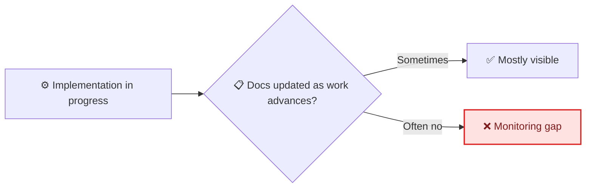

# ADR-004: Mandatory Source-of-Truth Sync During and At Task Completion

| Field               | Value                                            |
| ------------------- | ------------------------------------------------ |
| **Status**          | Accepted                                         |
| **Date**            | 2026-02-13                                       |
| **Decision makers** | Clayton Young                                    |
| **Consulted**       | AI agents (repo workflow hardening pass)         |
| **Informed**        | All contributors and agents working in this repo |

---

## 📋 Context

### What prompted this decision?

The repo already adopted "Everything is Code" for PRs, issues, and kanban records (ADR-003), but update timing was not strict enough for live monitoring. Agents could work for long stretches and only sync records at the end.

That creates drift between code changes and project-management records, which weakens the repo's single-source-of-truth model.

### Current state

### Constraints

- Must stay lightweight and human-readable (markdown + git)
- Must work for both human and agent contributors
- Must preserve ADR-003 principle: repository files are the authoritative record

### Requirements

This decision must:

- [x] Define mandatory pre-work, in-progress, and post-verification record updates
- [x] Cover PR, issue, and kanban synchronization throughout execution
- [x] Require running `./scripts/ci-local.sh` before commit/push when local environment supports it
- [x] Require explicit skip rationale in PR/issue when local CI cannot run in current environment
- [x] Define when ADR creation/update is required
- [x] Be explicit in agent entrypoint instructions (`AGENTS.md`)

---

## 🔍 Options Considered

### Option A: Mandatory live sync loop + completion gate in agent entrypoint docs

**Description:** Require PR/issue/kanban updates before implementation, throughout milestones, before/after verification, and before task completion; require ADR evaluation for durable decisions.

**Pros:**

- Clear and enforceable contributor behavior
- Keeps records current with code changes
- Matches single-source-of-truth philosophy

**Cons:**

- Adds one explicit process step to every non-trivial task

### Option B: Best-effort reminder only

**Description:** Mention record updates as guidance, but do not make them mandatory.

**Pros:**

- Lower friction

**Cons:**

- Drift remains likely
- Inconsistent project history quality

### Option C: Fully automated sync tooling

**Description:** Build automation that attempts to infer and update issue/kanban/PR/ADR files.

**Pros:**

- Lower manual effort after implementation

**Cons:**

- Higher complexity and maintenance burden
- Risk of incorrect or noisy automatic updates

### Decision matrix

| Criterion                 | Weight | Option A | Option B | Option C |
| ------------------------- | ------ | -------- | -------- | -------- |
| Consistent record quality | High   | ✅       | ❌       | ⚠️       |
| Simplicity                | High   | ✅       | ✅       | ❌       |
| Drift prevention          | High   | ✅       | ❌       | ⚠️       |
| Operational overhead      | Medium | ✅       | ✅       | ❌       |

---

## 🎯 Decision

**We chose Option A: mandatory live sync loop plus completion gate in `AGENTS.md` and `agentic/instructions.md`.**

Workflow execution now requires explicit synchronization of PR/issue/kanban records before and during implementation, before/after verification, and at completion, plus ADR evaluation for durable decisions. It also requires running `./scripts/ci-local.sh` before commit/push when local environment support exists, with a documented skip rationale when unavailable. This turns source-of-truth maintenance and pre-push validation from "good practice" into required workflow behavior.

### Why not the others?

- **Option B was rejected because:** reminders without a gate do not prevent drift.
- **Option C was rejected because:** automation complexity is not needed for a template baseline and can be added later if truly required.

---

## ⚡ Consequences

### Positive

- Stronger single-source-of-truth discipline
- Better continuity for future contributors and agents
- Higher confidence that docs and code represent the same project state

### Negative

- Slightly more process overhead during execution for each substantial task

### Risks

| Risk                                | Likelihood | Impact | Mitigation                                                                |
| ----------------------------------- | ---------- | ------ | ------------------------------------------------------------------------- |
| Contributors skip live sync updates | Medium     | Medium | Keep loop in AGENTS entrypoint and PR review checklist                    |
| Over-creation of ADRs               | Low        | Low    | Require ADR only for durable decisions; otherwise state `No ADR required` |

### Implementation impact

```mermaid
flowchart LR
    accTitle: Execution and Completion Flow After ADR-004
    accDescr: Tracking files are updated before work during milestones and after verification with final completion sync

    plan[📋 Plan set] --> presync[📝 Update PR issue kanban]
    presync --> impl[⚙️ Implement milestone]
    impl --> midsync[📝 Update progress blockers scope]
    midsync --> testprep[🧪 Update planned verification]
    testprep --> verify[✅ Run tests and checks]
    verify --> postsync[📝 Update results in PR issue kanban]
    postsync --> adr{🏛️ Durable decision?}
    adr -->|Yes| makeadr[✅ Create or update ADR]
    adr -->|No| noadr[✅ Note No ADR required]
    makeadr --> done[✅ Task complete]
    noadr --> done

    classDef good fill:#dcfce7,stroke:#166534,stroke-width:2px,color:#14532d
    class done good
```

---

## 📋 Implementation plan

| Step                                                               | Owner      | Target date | Status  |
| ------------------------------------------------------------------ | ---------- | ----------- | ------- |
| Add mandatory progress sync loop to `AGENTS.md`                    | Human + AI | 2026-02-13  | ✅ Done |
| Mirror live sync loop in `agentic/instructions.md`                 | Human + AI | 2026-02-13  | ✅ Done |
| Update workflow docs for pre/during/post record updates            | Human + AI | 2026-02-13  | ✅ Done |
| Add local `scripts/ci-local.sh` pre-push rule with env exception   | Human + AI | 2026-02-13  | ✅ Done |
| Update active issue/kanban/PR records to reflect governance change | Human + AI | 2026-02-13  | ✅ Done |

---

## 🔗 References

- [AGENTS.md](../../AGENTS.md)
- [Agent instructions](../instructions.md)
- [ADR-003: Everything is Code](./ADR-003-everything-is-code.md)

---

## Review log

| Date       | Reviewer      | Outcome  |
| ---------- | ------------- | -------- |
| 2026-02-13 | Clayton Young | Accepted |

---

_Last updated: 2026-02-13_
