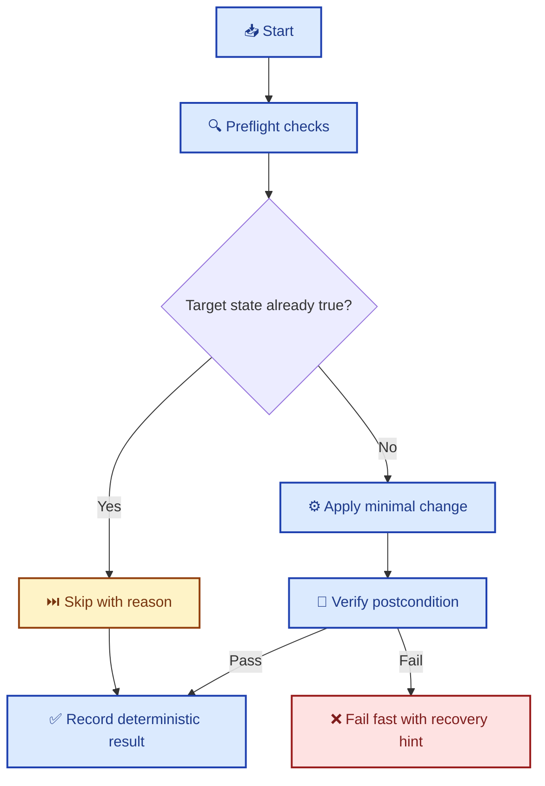

# Idempotent Script Design Patterns

> Build every operational script so it can run multiple times safely, produce the same intended state, and fail in ways that are observable and recoverable.

---

## 🎯 Why this exists

This repository treats automation as production code. Local CI, review orchestration, environment setup, and maintenance scripts must all be:

- **Safe to re-run** after partial failure
- **Predictable** under retries and restarts
- **Clear** in terminal output for both humans and agents
- **Auditable** when something fails

If a script cannot be run twice safely, it is incomplete.

---

## ✅ Definition

An idempotent script is a script where repeated execution converges to the same desired system state, rather than repeatedly applying side effects.

Practical rule:

- **First run**: performs required changes
- **Second+ runs**: detect existing state and no-op or reconcile cleanly

---

## 🔄 Execution model



---

## 🧱 Core patterns (required)

### 1) Check-before-act

Never perform a mutation before checking if it is needed.

```bash
# Good: only create if missing
if [[ ! -d "${target_dir}" ]]; then
  mkdir -p "${target_dir}"
fi

# Good: only append when value absent
if ! grep -q "^export APP_MODE=prod$" ~/.bashrc; then
  printf '\nexport APP_MODE=prod\n' >> ~/.bashrc
fi
```

### 2) Declarative convergence

Prefer "make state true" logic over "apply step N" logic.

```bash
ensure_line_in_file() {
  local line="$1"
  local file="$2"
  grep -qxF "$line" "$file" || printf '%s\n' "$line" >> "$file"
}
```

### 3) Atomic writes

Write to a temporary file first, then replace in one operation.

```bash
tmp_file="$(mktemp)"
generate_content > "$tmp_file"
mv "$tmp_file" "$target_file"
```

`rename(2)` guarantees atomic replacement semantics on the same filesystem.[^1]

### 4) Locking for shared resources

If concurrent runs are possible, guard critical sections with a lock.

```bash
exec 9>"${REPO_ROOT}/.tmp/ci.lock"
flock -n 9 || {
  printf '⚠️  Another run is in progress\n' >&2
  exit 1
}
```

`flock` is a standard, robust mechanism for process-level mutual exclusion on Linux systems.[^2]

### 5) Safe retries with bounded backoff

Retries should be explicit, bounded, and only for transient operations.

```bash
retry() {
  local attempts="$1"
  local delay="$2"
  shift 2
  local n=1
  while true; do
    "$@" && return 0
    if [[ $n -ge $attempts ]]; then
      return 1
    fi
    sleep "$delay"
    n=$((n + 1))
  done
}
```

### 6) Deterministic cleanup

Always clean temporary resources, even on failure.

```bash
tmp_dir="$(mktemp -d)"
cleanup() { rm -rf "$tmp_dir"; }
trap cleanup EXIT
```

### 7) Explicit postcondition verification

After each mutation, verify the intended state.

```bash
pnpm install --frozen-lockfile
pnpm list --depth=0 >/dev/null
```

If verification fails, stop immediately with a clear error.

---

## 🖥️ Terminal output standards

Output must be professional, sparse, and machine-readable enough for automation.

### Status vocabulary

- `✅ pass` completed successfully
- `❌ fail` unrecoverable failure
- `⚠️ warn` non-fatal issue
- `⏭️ skip` step intentionally skipped
- `🔄 run` step in progress

### Formatting rules

- One line per step result
- Stable step names (no random text)
- Include duration for every executed step
- Keep color optional; message meaning must survive without ANSI
- End with a compact summary block

Example summary format:

```text
Step                     Status      Duration
──────────────────────   ─────────   ────────
lint                     ✅ pass     4s
test                     ✅ pass     19s
deploy                   ⏭️ skip     0s

Passed: 2  Failed: 0  Skipped: 1  Total: 23s
✅ CI PASSED
```

---

## 🧪 Script checklist (2026 baseline)

Use this checklist for every script in `scripts/` and operational tasks in the repo.

- [ ] `set -euo pipefail` enabled
- [ ] Check-before-act guards on every mutation
- [ ] No duplicate append operations
- [ ] Atomic write strategy for generated files
- [ ] Locking strategy for shared state (if concurrent runs possible)
- [ ] Deterministic cleanup with `trap`
- [ ] Retries bounded and scoped to transient actions only
- [ ] Clear postcondition checks
- [ ] Step-level status output with final summary
- [ ] Safe defaults (`deploy` and destructive actions opt-in)

---

## 🧭 Anti-patterns (forbidden)

- Blindly appending to config files on every run
- Recreating resources without existence checks
- Writing partial output directly to destination files
- Infinite retries without bounds
- Silent failure (`|| true` on critical steps)
- Hidden side effects behind vague logs

---

## 🛠️ Repository example: local CI runner

`scripts/ci-local.sh` is the reference implementation in this repo.

Observed idempotent patterns in that script:

- **Safe defaults:** `RUN_DEPLOY=false` until `--deploy` is explicitly passed
- **Conditional execution:** review/deploy steps are opt-in flags
- **Preflight loading:** `.env` loaded only if present
- **Step tracking:** deterministic `STEP_RESULTS` and `STEP_DURATIONS`
- **Consistent summary:** fixed status vocabulary with final pass/fail gate

When editing `scripts/ci-local.sh`, preserve these convergence and observability guarantees.

---

## 🔗 Related standards

- [contribute_standards.md](contribute_standards.md)
- [operational_readiness.md](operational_readiness.md)
- [agent_error_recovery.md](agent_error_recovery.md)
- [../scripts/ci-local.sh](../scripts/ci-local.sh)

---

## 📚 References

[^1]: Linux `rename(2)` manual — atomic replacement behavior on same filesystem: <https://man7.org/linux/man-pages/man2/rename.2.html>

[^2]: Linux `flock(1)` manual — advisory file locking usage: <https://man7.org/linux/man-pages/man1/flock.1.html>

---

_Last updated: 2026-02-13_
