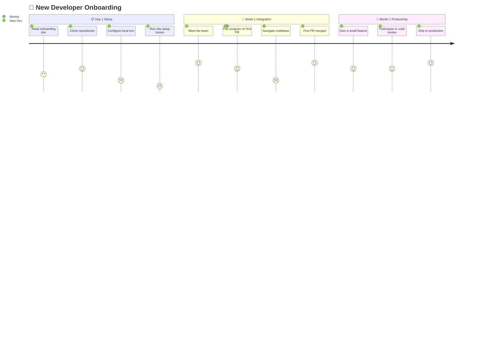
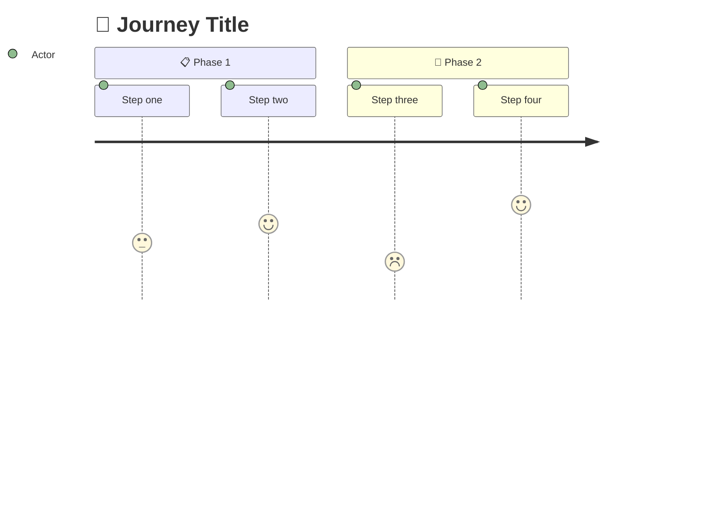
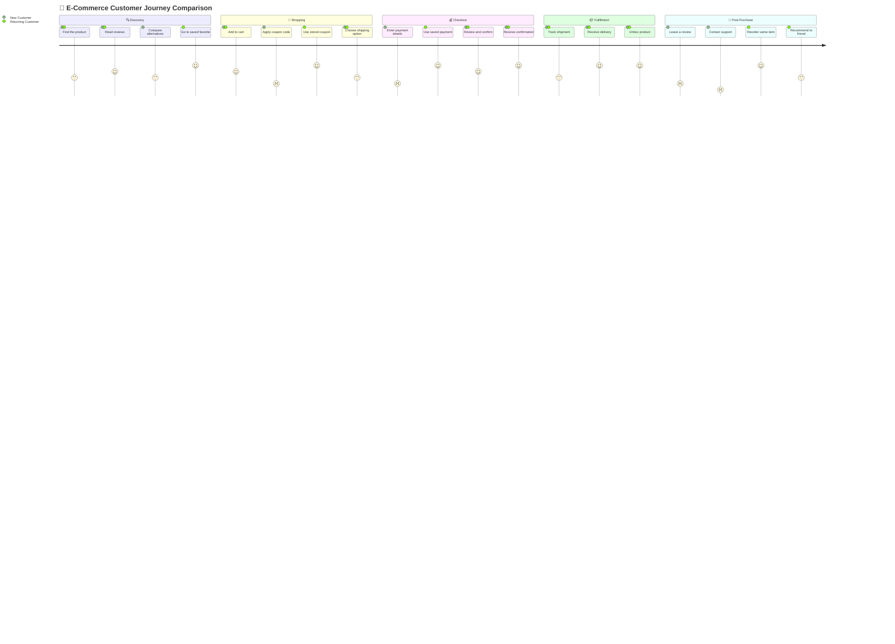

# User Journey

> **Back to [Style Guide](../mermaid_style_guide.md)** — Read the style guide first for emoji, color, and accessibility rules.

**Syntax keyword:** `journey`
**Best for:** User experience mapping, customer journey, process satisfaction scoring, onboarding flows
**When NOT to use:** Simple processes without satisfaction data (use [Flowchart](flowchart.md)), chronological events (use [Timeline](timeline.md))

---

## Exemplar Diagram

---

## Tips

- Scores: **1** = 😤 frustrated, **3** = 😐 neutral, **5** = 😄 delighted
- Assign actors after the score: `5 : Actor1, Actor2`
- Use `section` with **emoji prefix** to group by time period or phase
- Focus on **pain points** (low scores) — that's where the insight is
- Keep to **3–4 sections** with **3–4 steps** each

---

## Template

---

## Complex Example

A multi-persona e-commerce journey comparing a New Customer vs Returning Customer across 5 phases. The two actors experience the same flow with different satisfaction scores, revealing exactly where first-time UX needs investment.

### Why this works

- **Two personas on the same map** — instead of two separate diagrams, both actors appear in each step. The satisfaction gap between New Customer (2-3) and Returning Customer (4-5) is immediately visible in checkout and post-purchase.
- **5 sections follow the real funnel** — discovery → shopping → checkout → fulfillment → post-purchase. Each section tells a story about where the experience breaks down for new users.
- **Some steps are persona-specific** — "Compare alternatives" is only New Customer, "Reorder same item" is only Returning Customer. This shows divergent paths within the shared journey.
- **Low scores are the actionable insight** — New Customer scores 1-2 on payment entry, coupon application, and support contact. These are the specific UX investments that would improve conversion.
