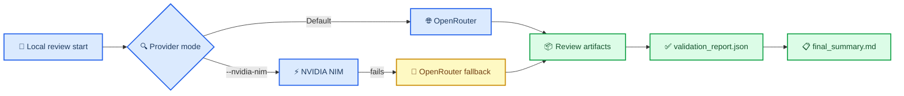

# Issue-00000002: Provider Priority, Fail-Fast Review, and Local Cost Visibility

| Field              | Value                                                                                 |
| ------------------ | ------------------------------------------------------------------------------------- |
| **Issue**          | Planned (not yet created in GitHub UI)                                                |
| **Type**           | 🐛 Bug                                                                                |
| **Severity**       | 🔴 High                                                                               |
| **Priority**       | P1                                                                                    |
| **Reporter**       | Human                                                                                 |
| **Assignee**       | Human + AI agents                                                                     |
| **Date reported**  | 2026-02-13                                                                            |
| **Status**         | In progress (OpenRouter-default stable; NVIDIA explicit opt-in path remains optional) |
| **Users affected** | All local users running `./scripts/ci-local.sh --review`                              |
| **Revenue impact** | Indirect — blocked/unclear review runs reduce onboarding trust                        |
| **Resolved in**    | [PR-#1](../pr/pr-00000001-agentic-docs-and-monorepo-modernization.md) (in progress)   |

---

## 📋 Summary

Local CrewAI review behavior needed three reliability fixes for template usability:

1. Provider selection needed a stable low-cost default for local runs, with NVIDIA available only as explicit opt-in.
2. Review orchestration continued through multiple crews after provider availability failures, increasing noise and runtime.
3. Cost/pricing output was only consistently visible in GitHub Actions summary, not explicitly surfaced in local terminal output.
4. NVIDIA Kimi provider returns intermittent empty responses/timeouts during multi-agent quick review, preventing consistently successful local review completion.

### Customer impact

| Dimension             | Assessment                                                  |
| --------------------- | ----------------------------------------------------------- |
| **Who's affected**    | Students and maintainers running local review               |
| **How many**          | Entire class cohort using this template                     |
| **Business impact**   | Slower troubleshooting, weaker confidence in review tooling |
| **Workaround exists** | Partial — inspect workspace files manually                  |

---

## 🔄 Reproduction Steps

### Environment

| Detail               | Value                |
| -------------------- | -------------------- |
| **Version / commit** | Current working tree |
| **Environment**      | Local                |
| **OS / Browser**     | Linux shell          |
| **Account type**     | N/A                  |

### Steps to reproduce

1. Set `NVIDIA_API_KEY` and run `./scripts/ci-local.sh --review`.
2. Trigger provider-side no-response, credits exhaustion, or endpoint mismatch.
3. Observe orchestration behavior and terminal summary output.

### Expected behavior

- OpenRouter is used by default for local review runs.
- NVIDIA is used only when explicitly requested for a run.
- First hard provider-availability failure aborts remaining crews immediately.
- Local output includes review summary and pricing/cost section visibility.
- Local review completes successfully with actionable findings when provider is healthy.

### Actual behavior (before fixes)

- Provider routing and local cost visibility were inconsistent.
- Fatal provider errors could allow multiple follow-on crew attempts before stop.
- Review runs could stall too long before failing when the provider degraded.

---

## 🔍 Investigation

### Root cause

- `get_llm()` only required OpenRouter key and did not prioritize NVIDIA.
- Orchestration caught crew exceptions and continued for many stages.
- Local script summary view was not explicitly extracting pricing/cost sections.
- Local review flow had no hard timeout guard, so degraded provider runs could remain active too long.

### Reliability architecture

### Investigation log

| Date       | Who      | Finding                                                                                                                                              |
| ---------- | -------- | ---------------------------------------------------------------------------------------------------------------------------------------------------- |
| 2026-02-13 | Human+AI | Provider selection path required explicit NVIDIA-first behavior                                                                                      |
| 2026-02-13 | Human+AI | Fatal provider failures should short-circuit orchestration immediately                                                                               |
| 2026-02-13 | Human+AI | Local summary needed explicit pricing/cost extraction                                                                                                |
| 2026-02-13 | Human+AI | NVIDIA Kimi requests can return empty/timeout responses during multi-agent runs                                                                      |
| 2026-02-13 | Human+AI | Raw NVIDIA chat responses often return `content: null` with `reasoning_content` populated                                                            |
| 2026-02-13 | Human+AI | Local quick-review NVIDIA path still intermittently hits read timeouts on larger prompts                                                             |
| 2026-02-14 | Human+AI | Local quick-review now executes 3 reviewer passes on fallback path; output depth and review context improved                                         |
| 2026-02-14 | Human+AI | Cost table readability was improved by rendering aligned fixed-width terminal columns from markdown summary data                                     |
| 2026-02-14 | Human+AI | Post-hardening rerun still showed intermittent NVIDIA quick-review parse/response failure; fallback summary path remained stable                     |
| 2026-02-14 | Human+AI | Post-commitlint-polish full rerun stayed green; NVIDIA primary timed out then fell back cleanly to OpenRouter without CI failure                     |
| 2026-02-14 | Human+AI | Local default provider switched to OpenRouter (`--review`, `--full-review`); NVIDIA moved behind explicit `--nvidia-nim` opt-in                      |
| 2026-02-14 | Human+AI | Full-review and specialist paths now synthesize required JSON outputs when crews return non-persisted text, preserving detailed summary completeness |
| 2026-02-14 | Human+AI | Added scope contract artifact (`scope.json`) and merge-base aware review metadata in local and CI prep paths                                         |
| 2026-02-14 | Human+AI | Added validation ledger (`validation_report.json`) and specialist/full artifact validation tracking                                                  |
| 2026-02-14 | Human+AI | Added data engineering specialist crew and routing label (`crewai:data-engineering`) for SQL/schema/ETL review coverage                              |
| 2026-02-14 | Human+AI | Hardened CrewAI result parsing to avoid `.json` accessor exceptions and extract JSON from task/raw payloads safely                                   |
| 2026-02-14 | Human+AI | Strengthened specialist/full task contracts with explicit JSON-only final response requirements                                                      |

---

## ✅ Resolution

### Fix description

Implemented provider priority + fail-fast behavior + local pricing visibility updates.

Key updates:

- `.crewai/utils/model_config.py`
  - Switched local default provider/model path to OpenRouter using `gemini-flash-lite` (`openrouter/google/gemini-2.5-flash-lite`)
  - Kept NVIDIA path available only with explicit `FORCE_NVIDIA=true` opt-in
  - Preserved model registry overrides for non-default model experimentation
- `.crewai/main.py`
  - Added fatal availability detection and immediate orchestration abort
  - Added fail-fast fallback summary content with explicit abort reason and cost section
  - Added normalized payload parsing helpers for non-standard provider response payloads
  - Added direct NVIDIA chat-completions local quick-review path (OpenAI-compatible endpoint) to reduce provider mapping issues
  - Added JSON extraction fallback from NVIDIA `reasoning_content` when `content` is absent
- `scripts/ci-local.sh`
  - Added `--nvidia-nim` opt-in flag; OpenRouter is now the default local provider
  - Updated review env prompting/help and runtime provider messaging for OpenRouter-default behavior
  - Exports `FORCE_NVIDIA=true` only for explicit NVIDIA-opt-in runs
  - Always prints review summary even on review failure
  - Added local pricing/cost section extraction from summary markdown
  - Added aligned fixed-width rendering for local pricing/cost panel (readable columns in terminal)
  - Added hard timeout guard (`CREWAI_REVIEW_TIMEOUT_SECONDS`, default 90s) with fallback summary
  - Added explicit OpenRouter fallback retry after NVIDIA failure, with NVIDIA error surfaced in terminal output
  - If NVIDIA fails once during quick-review multipass, disables NVIDIA for remaining passes in that run (no repeated per-pass failures)
  - Added NVIDIA-primary timeout override (`CREWAI_NVIDIA_TIMEOUT_SECONDS`, default 45s) for faster fallback
  - Added explicit timeout error line when NVIDIA primary exits on timeout before writing summary metadata
  - Updated website build/deploy paths from `website/` to `apps/web/` after monorepo layout modernization
- `package.json`
  - Updated markdownlint script to ignore `.crewai/workspace/**` artifacts so full local CI remains deterministic after review runs
- `.crewai/main.py`
  - Local quick-review shortcut now logs token/cost metrics to `CostTracker`, enabling non-empty cost table output in `final_summary.md`
  - Local quick-review shortcut now runs 3 reviewer passes (`Diff`, `Risk`, `Actionability`) and aggregates deduplicated findings
  - `quick_review.json` now includes `reviewer_summaries`, `provider_used`, and `calls_executed` for richer final output
  - Fallback summary now prints reviewer-pass summaries and avoids duplicate suggestion count wording in section headers
  - Full-review/specialist flows now synthesize required output JSON files when crews do not persist files, ensuring complete final-summary inputs
  - Added artifact validation tracking and persistence provenance (`validation_report.json`) for full and specialist outputs
  - Added `data_engineering` specialist crew orchestration wiring and fallback summary coverage
- `.crewai/utils/specialist_output.py`
  - Added `data_engineering` specialist registry entry, output contract, and autodetect heuristics
- `.crewai/config/tasks/data_engineering_review_tasks.yaml`, `.crewai/crews/data_engineering_review_crew.py`, `.crewai/config/agents.yaml`
  - Added dedicated data engineering specialist review path
- `.github/workflows/crewai-review-reusable.yml`
  - Added `scope.json` generation for CI parity with local merge-base-aware review context
  - Added `context_pack.json`, `context_pack.md`, and `commit_messages.txt` generation so CI crews consume the same context contract as local reviews
- Docs and env templates updated to reflect provider priority
- Added federated ADR governance and CrewAI-local ADR log for subsystem decision tracking
- Workspace layout updated to monorepo-first structure (`apps/`, `services/`, `packages/`, `data/sql/`) while preserving existing review flow
- Main CI orchestration grouped into explicit stage gates so CrewAI review executes after upstream validation/test/deploy outputs are complete
- GitHub CrewAI review workflow now receives NVIDIA secrets (`NVIDIA_API_KEY`/`NVIDIA_NIM_API_KEY`) in addition to OpenRouter fallback to align with local NVIDIA-primary behavior

### Verification

- [x] Provider selection now defaults to OpenRouter in local mode
- [x] NVIDIA provider path is available only via explicit `--nvidia-nim` opt-in
- [x] Fatal provider error aborts on first crew failure (no multi-crew cascade)
- [x] Local terminal shows review summary on failure paths
- [x] Local terminal supports pricing/cost section extraction
- [x] Local review exits quickly on timeout/no-response paths (timeout guard enforced)
- [x] Local pricing/cost section shows per-call table and totals when fallback LLM call succeeds
- [x] Full local `./scripts/ci-local.sh --review` pipeline passes after markdownlint workspace exclusion
- [x] NVIDIA timeout failures are explicitly surfaced in local terminal output (`NVIDIA error: ...`)
- [x] Full `./scripts/ci-local.sh --review` remains green with deterministic fast fallback (45s NVIDIA primary window)
- [x] Local quick-review executes 3 reviewer calls in fallback mode (visible in summary and cost table)
- [x] Local final summary now includes reviewer pass summaries (`Diff`, `Risk`, `Actionability`)
- [x] Local pricing/cost terminal panel renders aligned columns for readability
- [x] Local phase-1 format/lint path verified to write changes in place (`./scripts/ci-local.sh --step format`)
- [x] Provider fallback path is NVIDIA primary then OpenRouter fallback
- [x] Post-CI-regroup local parity check passed (`./scripts/ci-local.sh --review`) with deploy steps skipped locally by design
- [x] GitHub workflow parity updated: CrewAI review now accepts NVIDIA primary secret path with OpenRouter fallback
- [x] Post-concurrency/provider-hardening local parity rerun completed; CI phases pass and deploy skips remain local-only by design
- [x] Latest local rerun confirms quick-review intermittent NVIDIA failure is non-fatal and captured in final summary
- [x] Latest full rerun after Phase-1 commitlint polish still passes end-to-end and preserves deterministic NVIDIA->OpenRouter failover
- [x] Latest default local rerun completes with OpenRouter-only provider path (no NVIDIA attempts)
- [x] Latest full-review rerun (`--full-review`) produces full/specialist JSON outputs plus detailed `final_summary.md`
- [x] Local and CI review preparation now include `scope.json` review-scope contract metadata
- [x] Full/specialist runs now emit `validation_report.json` artifact-validation ledger
- [x] Data engineering specialist is available via `crewai:data-engineering` and included in full-review specialist expansion
- [ ] Local review consistently completes with high-quality findings on NVIDIA Kimi K2.5 (opt-in path)

### Lessons learned

Provider-availability failures should be classified as stop-the-line events, not recoverable per-crew errors. A fast timeout boundary is required to keep local CI predictable.

---

## 🔗 References

- [PR-#1](../pr/pr-00000001-agentic-docs-and-monorepo-modernization.md)
- [Issue-#3: Local review context pack and resilience](issue-00000003-local-review-context-pack-and-resilience.md)
- [Sprint W07 board (closed)](../kanban/sprint-2026-w07-agentic-template-modernization.md)
- [Sprint W08 board (active)](../kanban/sprint-2026-w08-crewai-review-hardening-and-memory.md)
- [SECRETS.md](../../../SECRETS.md)
- [ADR-005: Polyglot monorepo workspace layout](../../../agentic/adr/ADR-005-polyglot-monorepo-workspace-layout.md)
- [ADR-006: Federated ADR governance](../../../agentic/adr/ADR-006-federated-adr-governance.md)
- [ADR-007: Monorepo foundation and decision baseline](../../../agentic/adr/ADR-007-monorepo-foundation-and-decision-baseline.md)
- [CrewAI ADR index](../../../.crewai/adr/README.md)
- [ADR-004: Review scope contract and tiered diff strategy](../../../.crewai/adr/ADR-004-review-scope-contract-and-tiering.md)
- [ADR-005: Output validation ledger and data engineering specialist](../../../.crewai/adr/ADR-005-output-validation-and-data-engineering-specialist.md)

---

_Last updated: 2026-02-15 16:12 EST_
