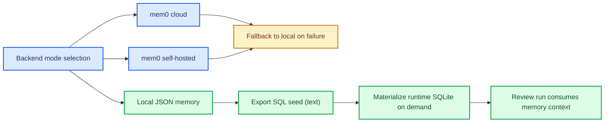

# Issue-00000004: Memory backend self-hosted support and SQL-seed local-first persistence

| Field              | Value                                                                               |
| ------------------ | ----------------------------------------------------------------------------------- |
| **Issue**          | Planned (not yet created in GitHub UI)                                              |
| **Type**           | ✨ Feature request                                                                  |
| **Priority**       | P1                                                                                  |
| **Requester**      | Human                                                                               |
| **Assignee**       | Human + AI agents                                                                   |
| **Date requested** | 2026-02-15                                                                          |
| **Status**         | In progress                                                                         |
| **Target release** | Sprint W08                                                                          |
| **Tracked in**     | [PR-#1](../pr/pr-00000001-agentic-docs-and-monorepo-modernization.md) (in progress) |

---

## 📋 Summary

### Problem statement

Persistent review memory already exists, but local operators need stronger backend control: self-hosted mem0 mode, text-first persisted artifacts, and deterministic SQL-seed export so runtime databases can be created on demand without committing binary files.

### Requested outcome

- Local-first memory remains default and repo-safe.
- mem0 cloud and mem0 self-hosted can be enabled via explicit configuration.
- Memory remains auditable as text (`.json` + `.sql`) in `.crewai/memory/`.
- Runtime DB creation is optional and generated on demand (local CI/GitHub Actions), with no binary DB files committed.

---

## 🎯 Success criteria

- [x] Add explicit backend mode selection for `local`, `cloud`, and `self-hosted`.
- [x] Add self-hosted endpoint support (`MEM0_SELF_HOSTED_URL`).
- [x] Keep fallback-to-local behavior if mem0 init fails.
- [x] Add SQL seed export for memory state (`.crewai/memory/sql/memory_seed.sql`).
- [x] Add optional SQLite materialization from SQL seed (runtime-only).
- [x] Add memory compaction command for dedupe + trend trim.
- [x] Add tests covering compaction, SQL export, and SQLite materialization.
- [x] Run end-to-end local review verification after memory updates.

---

## 🔍 Design flow

---

## ✅ Implementation notes

- `.crewai/tools/memory_manager.py`
  - Added backend mode resolver (`MEM0_BACKEND`, plus legacy toggles).
  - Added self-hosted mem0 initialization path and safe fallback to local mode.
  - Added `optimize_observation`, `compact_memory`, `export_sql_seed`, `materialize_sqlite_db`, and `backend_status` helpers.
  - Added automatic SQL-seed refresh in `save()`.
- `.crewai/tools/memory_cli.py`
  - Added `--compact-memory`, `--dry-run`, `--max-trend-entries`.
  - Added `--export-sql`, `--sql-output`, `--materialize-sqlite`, `--backend-status`.
  - Added `--no-optimize` and `--optimize-model` for `--add-memory`.
- `.crewai/tests/test_memory_manager.py`, `.crewai/tests/test_memory_cli.py`
  - Added coverage for compaction behavior, SQL export, SQLite materialization, and CLI option paths.
- `.crewai/memory/sql/memory_seed.sql`
  - Added generated text seed file for reproducible runtime memory hydration.
- Verification evidence:
  - `./scripts/ci-local.sh --complete-full-review` passed in local mode after memory + identity updates (format/lint/link-check/tests/build/review all green; deploy steps skipped locally by policy).

---

## 🔗 References

- [PR-#1](../pr/pr-00000001-agentic-docs-and-monorepo-modernization.md)
- [Issue-#3](issue-00000003-local-review-context-pack-and-resilience.md)
- [Sprint W08 board](../kanban/sprint-2026-w08-crewai-review-hardening-and-memory.md)

---

_Last updated: 2026-02-15 12:54 EST_
