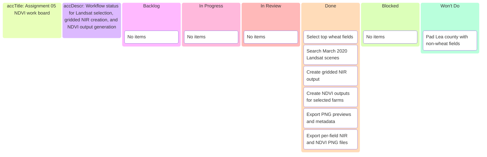

# Assignment 05 NDVI calculator — Kanban board

_Project board for branch `assignment-05-ndvi-calculator`._

---

## 📋 Board overview

**Goal:** Deliver a reproducible March 2020 Landsat NIR + NDVI workflow for selected New Mexico Winter Wheat farms.

---

## ✅ Done

- Implemented: `scripts/assignment_05_ndvi_calculator.py`
- Generated NIR/NDVI PNGs: `output/dashboard_assets/assignment-05/`
- Generated raster deliverables and metadata: `data/imagery/assignment-05/`
- Recorded PR and issue:
  - `docs/project/pr/pr-00000002-assignment-05-ndvi-calculator.md`
  - `docs/project/issues/issue-00000006-assignment-05-landsat-ndvi.md`

---

## 🚫 Won't do

- Do not backfill Lea county with non-wheat fields; keep selection wheat-only.

---

_Last updated: 2026-03-23_
