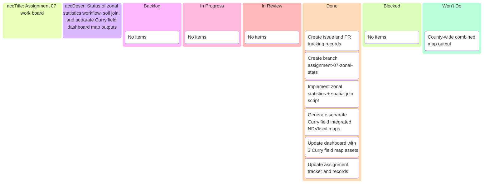

# Assignment 07 zonal stats — Kanban board

_Project board for branch `assignment-07-zonal-stats`._

---

## 📋 Board overview

**Goal:** Deliver mean NDVI zonal statistics for 7 wheat fields and three separate Curry field integrated spatial maps.

---

## ✅ Status

- Implementation complete. All planned Assignment 07 items moved to done.

---

_Last updated: 2026-03-23_
