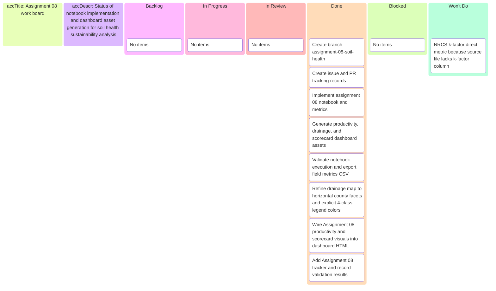

# Assignment 08 soil health — Kanban board

_Project board for branch `assignment-08-soil-health`._

---

## 📋 Board overview

**Goal:** Deliver notebook-based soil sustainability analytics and dashboard assets for soil health, erosion risk, carbon potential, wheat productivity, and drainage distribution.

---

## ✅ Status

- Refinement complete. Assignment 08 work items are in done.

---

_Last updated: 2026-04-03_
