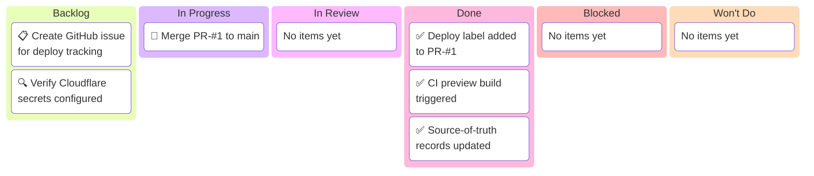

# Cloudflare Pages Deploy — Kanban Board

_Project: Cloudflare Pages production deployment for agent-project_
_Human · Last updated: 2026-02-17_

---

## 📋 Board Overview

**Period:** 2026-02-17 → 2026-02-18
**Goal:** Complete Cloudflare Pages production deployment after PR-#1 merge
**WIP Limit:** 2 items In Progress

### Visual board

_Kanban board showing Cloudflare deployment workflow from PR merge through verification:_

> ⚠️ Always show all 6 columns — Even if a column has no items, include it with a placeholder. This makes the board structure explicit and ensures categories are never forgotten. Use a placeholder like `[No items yet]` when a column is empty.

---

## 🚦 Board Status

| Column             | Count | WIP Limit | Status                   |
| ------------------ | ----- | --------- | ------------------------ |
| 📋 **Backlog**     | 2     | —         | Next up after merge      |
| 🔄 **In Progress** | 1     | 2         | 🟢 Under limit           |
| 🔍 **In Review**   | 0     | —         | —                        |
| ✅ **Done**        | 3     | —         | Pre-merge setup complete |
| 🚫 **Blocked**     | 0     | —         | Clear                    |
| 🚫 **Won't Do**    | 0     | —         | —                        |

> ⚠️ **Always include all 6 columns** — Each column represents a workflow state. Even if count is 0, keep the row visible. This prevents categories from being overlooked.

---

## 📋 Backlog

_Prioritized top-to-bottom. Top items are next to be pulled._

| #   | Item                                      | Priority | Estimate | Assignee | Notes                            |
| --- | ----------------------------------------- | -------- | -------- | -------- | -------------------------------- |
| 1   | Monitor `deploy-production` job execution | 🔴 High  | 10 min   | Human    | Watch CI at /actions after merge |
| 2   | Verify production URL accessibility       | 🔴 High  | 5 min    | Human    | HTTP 200 check                   |
|     | _[No items yet]_                          |          |          |          |                                  |

---

## 🔄 In Progress

_Items currently being worked on._

| Item                      | Assignee | Started    | Expected   | Days in column | Aging | Status      |
| ------------------------- | -------- | ---------- | ---------- | -------------- | ----- | ----------- |
| Merge PR-#1 via GitHub UI | Human    | 2026-02-17 | 2026-02-17 | 0              | 🟢    | 🟢 On track |

> 💡 **Aging indicator:** 🟢 Under expected time · 🟡 At expected time · 🔴 Over expected time — items aging red need attention or re-scoping.

> ⚠️ **WIP limit:** 1 / 2. Under limit — can pull more work if needed.

---

## 🔍 In Review

_Items awaiting or in verification._

| Item           | Author | Reviewer | PR  | Days in review | Aging | Status           |
| -------------- | ------ | -------- | --- | -------------- | ----- | ---------------- |
| [No items yet] |        |          |     |                |       | _[No items yet]_ |

---

## ✅ Done

_Completed this period._

| Item                                         | Assignee | Completed  | Cycle time | PR/Issue                                                                           |
| -------------------------------------------- | -------- | ---------- | ---------- | ---------------------------------------------------------------------------------- |
| Add `Deploy: Website Preview` label to PR-#1 | AI agent | 2026-02-17 | 0 days     | [#1](../../docs/project/pr/pr-00000001-agentic-docs-and-monorepo-modernization.md) |
| Trigger CI preview deployment                | AI agent | 2026-02-17 | 0 days     | [#1](../../docs/project/pr/pr-00000001-agentic-docs-and-monorepo-modernization.md) |
| Update PR record with merge/deploy status    | AI agent | 2026-02-17 | 0 days     | [#1](../../docs/project/pr/pr-00000001-agentic-docs-and-monorepo-modernization.md) |
| Update Issue-#1 status to resolved           | AI agent | 2026-02-17 | 0 days     | [#1](../../docs/project/issues/issue-00000001-agentic-documentation-system.md)     |
| Create Issue-#5 for deploy follow-up         | AI agent | 2026-02-17 | 0 days     | [#5](../../docs/project/issues/issue-00000005-cloudflare-deploy-follow-up.md)      |
| Create this kanban board                     | AI agent | 2026-02-17 | 0 days     | Board                                                                              |
| Commit and push all source-of-truth updates  | AI agent | 2026-02-17 | 0 days     | [#1](../../docs/project/pr/pr-00000001-agentic-docs-and-monorepo-modernization.md) |

---

## 🚫 Blocked

_Items that cannot proceed._

| Item           | Assignee | Blocked since | Blocked by | Escalated to | Unblock action       |
| -------------- | -------- | ------------- | ---------- | ------------ | -------------------- |
| [No items yet] |          |               |            |              | _[No blocked items]_ |

> 🔴 **0 items blocked.** All work flowing smoothly.

---

## 🚫 Won't Do

_Explicitly out of scope for this board period._

| Item           | Date decided | Decision owner | Rationale                        | Revisit trigger |
| -------------- | ------------ | -------------- | -------------------------------- | --------------- |
| [No items yet] |              |                | _[No items explicitly declined]_ |                 |

---

## 📊 Metrics

### This period

| Metric                             | Value  | Target | Trend |
| ---------------------------------- | ------ | ------ | ----- |
| **Throughput** (items completed)   | 7      | 8      | ↑     |
| **Avg cycle time** (start → done)  | 0 days | 1 day  | ↓     |
| **Avg lead time** (created → done) | 0 days | 1 day  | ↓     |
| **Avg review time**                | N/A    | N/A    | —     |
| **Flow efficiency**                | 100%   | 40%    | ↑     |
| **Blocked items**                  | 0      | 0      | →     |
| **WIP limit breaches**             | 0      | 0      | →     |
| **Items aging red**                | 0      | 0      | →     |

> 💡 **Flow efficiency** = active work time ÷ total cycle time × 100. A healthy team targets 40%+. Below 15% means items spend most of their time waiting, not being worked on.

<strong>📊 Historical Throughput</strong>

| Period          | Items completed | Avg cycle time | Blocked days |
| --------------- | --------------- | -------------- | ------------ |
| Sprint W08 2026 | 7+              | 0 days         | 0            |
| **Current**     | 7               | 0 days         | 0            |

---

## 📝 Board Notes

### Decisions made this period

- **2026-02-17:** Cloudflare Pages production deployment deferred to tomorrow (post-merge) to allow for focused deployment monitoring
- **2026-02-17:** All source-of-truth records (PR, issue, kanban) updated before merge to maintain git history accuracy

### Carryover from last period

- None — this is a fresh deployment tracking board spun up from Sprint W08 completion

### Upcoming dependencies

- **2026-02-18:** Human to merge PR-#1 and monitor production deployment
- **2026-02-18:** Verify Cloudflare Pages deployment succeeds within 10 minutes of merge

---

## 🔗 References

- [PR-#1: Agentic Documentation System + Repo Cleanup](../pr/pr-00000001-agentic-docs-and-monorepo-modernization.md)
- [Issue-#5: Cloudflare Pages Production Deployment Follow-up](../issues/issue-00000005-cloudflare-deploy-follow-up.md)
- [Sprint W08 Board](../kanban/sprint-2026-w08-crewai-review-hardening-and-memory.md) — Parent sprint
- [GitHub PR #1](https://github.com/SuperiorByteWorks-LLC/agent-project/pull/1)
- [GitHub Actions](https://github.com/SuperiorByteWorks-LLC/agent-project/actions)

---

_Next update: 2026-02-18 after deployment · Board owner: Human_

---
