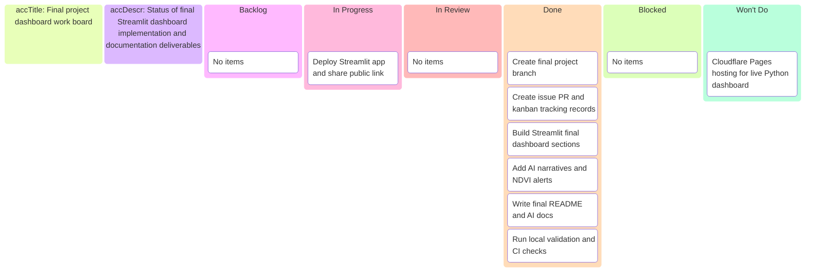

# Final project dashboard — Kanban board

_Project board for branch `feat/final-project-dashboard`._

---

## 📋 Board overview

**Goal:** Deliver an interactive final dashboard with five required visuals, AI narratives, NDVI alerts, and final documentation.

---

## ✅ Status

- Dashboard implementation is complete; validation is in progress.

---

_Last updated: 2026-04-07_
