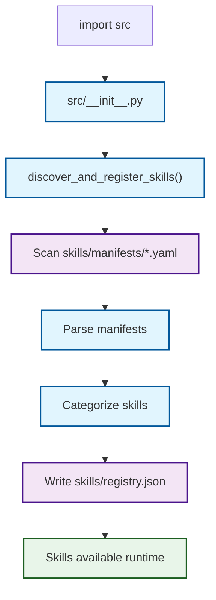
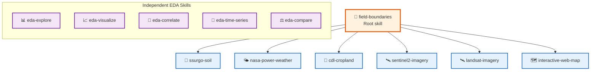

# Skills Documentation

_Comprehensive reference for 12 agricultural data analysis skills imported from borealBytes/ag-skills using the Agent Skills IO format._

---

## 📋 Overview

This repository includes **12 agent skills** for agricultural data analysis, imported from the [borealBytes/ag-skills](https://github.com/borealBytes/ag-skills) repository (MIT License). Skills are automatically discovered and registered when the `src` package is imported, following the [Agent Skills IO](https://agentskills.io/home) specification.

### Skills Summary

| Category          | Count | Skills                                                                                                                   |
| ----------------- | ----- | ------------------------------------------------------------------------------------------------------------------------ |
| **Data Download** | 7     | field-boundaries, ssurgo-soil, nasa-power-weather, cdl-cropland, sentinel2-imagery, landsat-imagery, interactive-web-map |
| **EDA**           | 5     | eda-explore, eda-visualize, eda-correlate, eda-time-series, eda-compare                                                  |

---

## 🏗️ Architecture Impact

### Auto-Discovery Flow

_The following diagram shows how skills are automatically discovered and registered when the src package is imported._



### File Structure

```
skills/
├── manifests/          # 12 YAML manifests (Agent Skills IO format)
│   ├── cdl-cropland.yaml
│   ├── eda-compare.yaml
│   ├── ... (10 more)
│   └── ssurgo-soil.yaml
├── registry.json       # Generated structured registry
├── README.md           # This file
└── vendor/
    └── ag-skills/      # Full vendor copy (12 skill packages)
        ├── cdl-cropland/
        │   ├── SKILL.md
        │   ├── examples/
        │   └── src/
        ├── eda-compare/
        │   ├── SKILL.md
        │   └── ...
        └── ... (10 more skills)

src/
├── __init__.py         # Auto-triggers loader on import
└── skills_loader.py    # Discovery and registration logic
```

### Registry Structure

The generated `skills/registry.json` provides structured access to all skills:

```json
{
  "generated_at": "2026-03-04T04:07:10Z",
  "skills_count": 12,
  "categories": {
    "data-download": [...],
    "eda": [...]
  },
  "skills": [...]
}
```

---

## 🔗 Dependency Chain

_Field-boundaries is the root skill that most other data download skills depend on._

_The following diagram shows the dependency relationships between skills._



---

## 💾 Data Download Skills

### field-boundaries

**Description:** Download USDA NASS Crop Sequence Boundaries for agricultural fields. Includes functions for downloading, visualizing, and exporting field boundary data.

**Prerequisites:** None (root skill)

**Code Example:**

```bash
# Download 2 fields from corn belt
cd skills/vendor/ag-skills/field-boundaries
uv run --with geopandas python << 'EOF'
from field_boundaries import download_fields
fields = download_fields(count=2, regions=['corn_belt'])
fields.to_file('my_fields.geojson')
print(f"Downloaded {len(fields)} fields")
EOF
```

**Example Data:** `examples/sample_2_fields.geojson`

---

### ssurgo-soil

**Description:** Download USDA NRCS SSURGO soil data. Retrieves soil properties (pH, organic matter, texture, drainage) for field locations.

**Prerequisites:** field-boundaries (uses field polygons for spatial queries)

**Code Example:**

```bash
cd skills/vendor/ag-skills/ssurgo-soil
uv run --with geopandas python << 'EOF'
from ssurgo_soil import get_soil_for_fields

soil = get_soil_for_fields(
    fields_path='../field-boundaries/examples/my_fields.geojson',
    output_path='soil_data.csv'
)
print(f"Retrieved {len(soil)} soil records")
EOF
```

**Example Data:** `examples/soil_data_2_fields.csv`

---

### nasa-power-weather

**Description:** Download NASA POWER daily weather data for agricultural field locations. Queries the free REST API for temperature, precipitation, solar radiation, humidity, and wind. Calculates Growing Degree Days (GDD).

**Prerequisites:** field-boundaries (uses field centroids for point queries)

**Code Example:**

```bash
cd skills/vendor/ag-skills/nasa-power-weather
uv run --with pandas python << 'EOF'
from nasa_power_weather import download_weather

weather = download_weather(
    fields_path='../field-boundaries/examples/my_fields.geojson',
    start_date='2020-01-01',
    end_date='2024-12-31',
    output_path='weather_data.csv'
)
print(f"Downloaded {len(weather)} weather records")
EOF
```

**Example Data:** `examples/sample_weather_2fields_2020_2024.csv`

---

### cdl-cropland

**Description:** Download USDA NASS Cropland Data Layer crop type maps for agricultural fields. Use when you need annual crop classifications, land cover data, crop rotation history, or crop type rasters clipped to field boundaries.

**Prerequisites:** field-boundaries (optional, for filtering)

**Code Example:**

```bash
cd skills/vendor/ag-skills/cdl-cropland
uv run --with rasterio python << 'EOF'
from cdl_cropland import download_cdl

cdl_data = download_cdl(
    fields_path='../field-boundaries/examples/my_fields.geojson',
    years=[2020, 2021, 2022, 2023, 2024],
    output_dir='cdl_data/'
)
print(f"Downloaded CDL data for {len(cdl_data)} years")
EOF
```

**Example Data:** `examples/sample_cdl_2_fields.csv`

---

### sentinel2-imagery

**Description:** Download Sentinel-2 Level-2A imagery for an AOI, compute NDVI with rasterio, and extract per-field NDVI statistics. Use when you need cloud-filtered Sentinel-2 scenes and field-level vegetation metrics.

**Prerequisites:** field-boundaries (for area of interest)

**Code Example:**

```bash
cd skills/vendor/ag-skills/sentinel2-imagery
uv run --with sentinelsat,rasterio python << 'EOF'
from sentinel2_imagery import download_sentinel2

scenes = download_sentinel2(
    fields_path='../field-boundaries/examples/my_fields.geojson',
    start_date='2023-05-01',
    end_date='2023-09-30',
    max_cloud_cover=20
)
print(f"Downloaded {len(scenes)} Sentinel-2 scenes")
EOF
```

**Example Data:** `examples/sample_aoi.geojson`, `examples/sample_ndvi_pixels.csv`

---

### landsat-imagery

**Description:** Search, download, and process Landsat 8/9 satellite imagery for agricultural fields. Use when you need to acquire Landsat scenes, calculate vegetation indices (NDVI/EVI), or perform long-term remote sensing analysis.

**Prerequisites:** field-boundaries (for area of interest)

**Code Example:**

```bash
cd skills/vendor/ag-skills/landsat-imagery
uv run --with landsatxplore,rasterio python << 'EOF'
from landsat_imagery import download_landsat

scenes = download_landsat(
    fields_path='../field-boundaries/examples/my_fields.geojson',
    start_date='2023-01-01',
    end_date='2023-12-31',
    max_cloud_cover=15
)
print(f"Downloaded {len(scenes)} Landsat scenes")
EOF
```

**Example Data:** `examples/sample_scene_metadata.json`

---

### interactive-web-map

**Description:** Create professional, self-contained interactive web maps for agricultural data visualization. Generate single HTML files with embedded data, layer controls, choropleth styling, and customizable dashboards using Leaflet.js.

**Prerequisites:** field-boundaries (for visualization)

**Code Example:**

```bash
cd skills/vendor/ag-skills/interactive-web-map
uv run --with folium,geopandas python << 'EOF'
from interactive_web_map import create_map
import geopandas as gpd

fields = gpd.read_file('../field-boundaries/examples/my_fields.geojson')
map_html = create_map(
    data=fields,
    title='My Field Boundaries',
    output_path='field_map.html'
)
print(f"Created interactive map: {map_html}")
EOF
```

**Example Data:** `examples/field_boundaries_map.html`, `examples/field_dashboard.html`

---

## 📊 EDA Skills

### eda-explore

**Description:** Explore and summarize agricultural datasets using pandas. Generate descriptive statistics, identify data types, find missing values, and detect outliers.

**Prerequisites:** None (works with any CSV data)

**Code Example:**

```python
import pandas as pd
from skills.vendor.ag-skills.eda-explore.src import explore_data

# Load any CSV
df = pd.read_csv('my_data.csv')

# Generate comprehensive exploration
exploration = explore_data(df)
print(exploration.summary())
print(exploration.missing_values())
print(exploration.outliers())
```

---

### eda-visualize

**Description:** Create histograms, scatter plots, heatmaps, and other visualizations for agricultural data using matplotlib and seaborn.

**Prerequisites:** None

**Code Example:**

```python
import pandas as pd
from skills.vendor.ag-skills.eda-visualize.src import create_plots

df = pd.read_csv('soil_data.csv')

# Create multiple visualizations
viz = create_plots(df)
viz.histogram(column='ph_water', bins=20)
viz.scatter(x='organic_matter', y='ph_water')
viz.heatmap(corr_matrix=True)
viz.save_all('output_plots/')
```

---

### eda-correlate

**Description:** Calculate correlation matrices and identify relationships between variables in agricultural datasets.

**Prerequisites:** None

**Code Example:**

```python
import pandas as pd
from skills.vendor.ag-skills.eda-correlate.src import correlation_analysis

df = pd.read_csv('weather_data.csv')

# Calculate correlations
corr = correlation_analysis(df)
print(corr.matrix())
print(corr.strongest(n=10))  # Top 10 strongest correlations
print(corr.visualize())  # Save heatmap
```

---

### eda-time-series

**Description:** Analyze time-based agricultural data to identify trends, seasonality, and patterns over time. Create time series plots, calculate rolling averages, detect anomalies, and forecast future values.

**Prerequisites:** None

**Code Example:**

```python
import pandas as pd
from skills.vendor.ag-skills.eda-time-series.src import time_series_analysis

df = pd.read_csv('weather_data.csv', parse_dates=['date'])

# Analyze time series
tsa = time_series_analysis(df, date_col='date', value_col='temperature')
tsa.plot_trend()
tsa.plot_seasonality()
tsa.detect_anomalies()
tsa.forecast(periods=30)  # 30-day forecast
```

---

### eda-compare

**Description:** Compare groups statistically. Perform t-tests, ANOVA, and other statistical comparisons between different groups in agricultural data.

**Prerequisites:** None

**Code Example:**

```python
import pandas as pd
from skills.vendor.ag-skills.eda-compare.src import compare_groups

df = pd.read_csv('yield_data.csv')

# Compare groups
comparison = compare_groups(df)
comparison.t_test(group_col='treatment', value_col='yield')
comparison.anova(group_col='fertilizer_type', value_col='yield')
comparison.box_plot(group_col='treatment', value_col='yield')
```

---

## 🚀 Usage Examples

### Access Skills Programmatically

```python
# Auto-loads all skills on import
import src

# Get skills by category
data_skills = src.get_skills_by_category("data-download")
eda_skills = src.get_skills_by_category("eda")

# Load specific skill metadata
field_bounds = src.load_skill("field-boundaries")
print(field_bounds['description'])
print(field_bounds['source'])

# View full registry
import json
with open('skills/registry.json') as f:
    registry = json.load(f)
    print(f"Total skills: {registry['skills_count']}")
    print(f"Categories: {list(registry['categories'].keys())}")
```

### Command Line

```bash
# View registry structure
jq '.categories' skills/registry.json

# Re-import skills (if vendor copy changes)
python3 scripts/import_ag_skills.py

# Manually run loader
python3 -c "from src.skills_loader import discover_and_register_skills; discover_and_register_skills()"
```

---

## ⚠️ Troubleshooting

| Issue                    | Cause                           | Solution                                                                               |
| ------------------------ | ------------------------------- | -------------------------------------------------------------------------------------- |
| **Skills not loading**   | Manifests missing or corrupt    | Run `python3 scripts/import_ag_skills.py`                                              |
| **Import errors**        | Missing Python dependencies     | Install requirements per skill (see each skill's SKILL.md)                             |
| **Registry outdated**    | Vendor copy updated             | Delete `skills/registry.json` and re-import                                            |
| **Module not found**     | src not in Python path          | Add repo root to PYTHONPATH: `export PYTHONPATH=/workspaces/EVTLR-Project:$PYTHONPATH` |
| **YAML parsing errors**  | Invalid manifest syntax         | Check `skills/manifests/*.yaml` files for syntax errors                                |
| **"No module named..."** | Running outside skill directory | Use absolute imports or ensure vendor/ag-skills is in path                             |

### Quick Diagnostics

```bash
# Check if all 12 manifests exist
ls skills/manifests/*.yaml | wc -l  # Should output: 12

# Verify registry was generated
cat skills/registry.json | jq '.skills_count'  # Should output: 12

# Test auto-load
python3 -c "import src; print(f'Skills loaded: {len(src._registry[\"skills\"])}')"
```

---

## 📄 License and Attribution

### License

All skills are licensed under the **MIT License** from [borealBytes/ag-skills](https://github.com/borealBytes/ag-skills)[^1].

```
MIT License

Copyright (c) 2024 Boreal Bytes

Permission is hereby granted, free of charge, to any person obtaining a copy
of this software and associated documentation files (the "Software"), to deal
in the Software without restriction, including without limitation the rights
to use, copy, modify, merge, publish, distribute, sublicense, and/or sell
copies of the Software, and to permit persons to whom the Software is
furnished to do so, subject to the following conditions:

The above copyright notice and this permission notice shall be included in all
copies or substantial portions of the Software.

THE SOFTWARE IS PROVIDED "AS IS", WITHOUT WARRANTY OF ANY KIND...
```

### Data Source Attribution

| Data Type         | Provider                             | License           | Citation                                                                               |
| ----------------- | ------------------------------------ | ----------------- | -------------------------------------------------------------------------------------- |
| Field Boundaries  | USDA NASS[^2]                        | Public Domain     | USDA National Agricultural Statistics Service Cropland Data Layer. 2023.               |
| Soil Data         | USDA NRCS SSURGO[^3]                 | Public Domain     | USDA Natural Resources Conservation Service. Soil Survey Geographic (SSURGO) Database. |
| Weather Data      | NASA POWER[^4]                       | Free Research Use | NASA POWER Project, NASA Langley Research Center.                                      |
| Satellite Imagery | ESA Sentinel-2[^5], USGS Landsat[^6] | Free Research Use | Contains modified Copernicus Sentinel data / USGS Earth Explorer.                      |
| Crop Data         | USDA NASS CDL[^7]                    | Public Domain     | USDA National Agricultural Statistics Service Cropland Data Layer.                     |

### Complete Attribution

When using these skills in research or publications, please cite:

```
Boreal Bytes. (2024). ag-skills: Agricultural Data Analysis Skills Package.
https://github.com/borealBytes/ag-skills

USDA National Agricultural Statistics Service Cropland Data Layer. (2023).
Published crop-specific data layer. Available at https://nassgeodata.gmu.edu/CropScape/

NASA POWER Project. (2024). NASA Prediction of Worldwide Energy Resources.
NASA Langley Research Center. https://power.larc.nasa.gov/
```

---

## 🔗 References

[^1]: borealBytes/ag-skills repository - <https://github.com/borealBytes/ag-skills/tree/skills-content>

[^2]: USDA NASS - <https://www.nass.usda.gov>

[^3]: USDA NRCS SSURGO - <https://www.nrcs.usda.gov/wps/portal/nrcs/main/soils/survey/geo/>

[^4]: NASA POWER - <https://power.larc.nasa.gov/>

[^5]: ESA Sentinel-2 - <https://sentinel.esa.int/web/sentinel/missions/sentinel-2>

[^6]: USGS Landsat - <https://earthexplorer.usgs.gov/>

[^7]: USDA NASS CDL - <https://nassgeodata.gmu.edu/CropScape/>

---

_Last updated: 2026-03-04_
