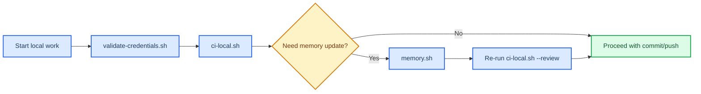
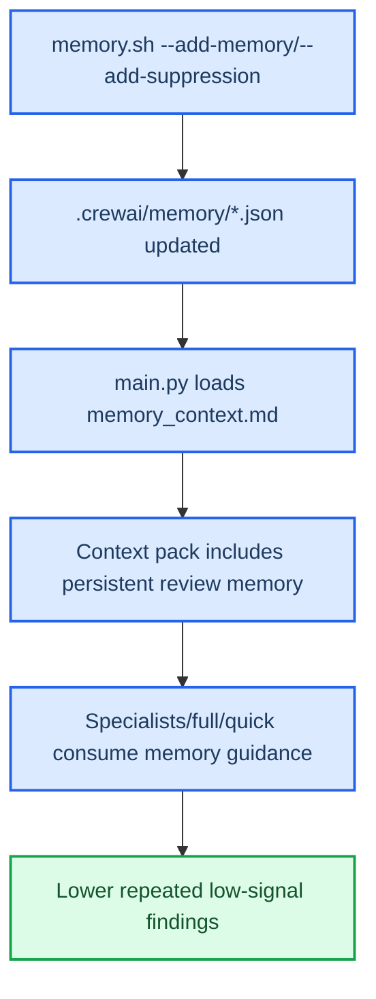
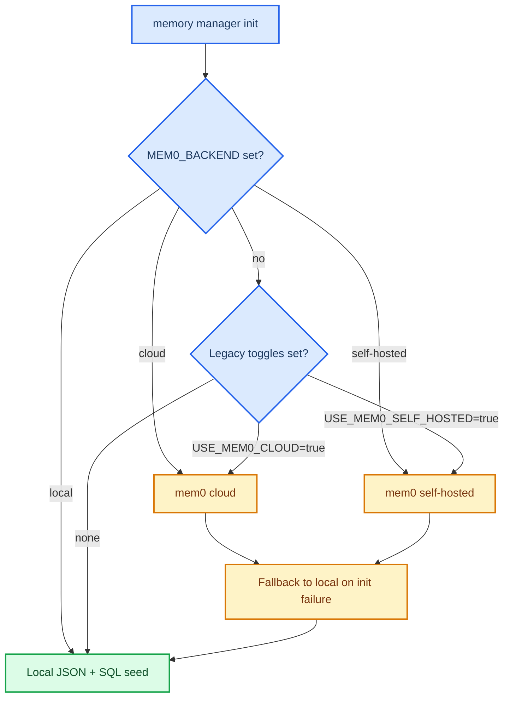

# Scripts Guide

_Operational scripts for local CI, credential checks, and persistent review memory management._

---

## 📋 Overview

The `scripts/` directory contains operator-facing automation used during local development and review.

| Script                            | Purpose                                                          | Common use                                                    |
| --------------------------------- | ---------------------------------------------------------------- | ------------------------------------------------------------- |
| `scripts/ci-local.sh`             | Runs local CI phases and optional CrewAI review                  | Pre-commit/pre-push validation and full review runs           |
| `scripts/validate-credentials.sh` | Checks required environment variables and provider configuration | Fast environment sanity check before review/deploy            |
| `scripts/memory.sh`               | Manages persistent CrewAI review memory and suppressions         | Add/list memory rules and reduce repeated low-signal findings |

---

## 🔄 Workflow map



---

## ⚙️ Script details

### `scripts/ci-local.sh`

Runs local pipeline phases with optional review/deploy paths.

Common examples:

```bash
# Full local CI (format/lint/tests/build; no review)
./scripts/ci-local.sh

# Quick review path
./scripts/ci-local.sh --review

# Full-review path (broader specialist routing)
./scripts/ci-local.sh --full-review --step review

# Complete full review (all specialists, complete-repo scope)
./scripts/ci-local.sh --complete-full-review --step review

# Single step execution
./scripts/ci-local.sh --step test-crewai
```

Key behavior:

- Acquires `.ci-local.lock` to prevent concurrent local runs.
- Clears `.crewai/workspace` at startup to avoid stale artifacts.
- Uses OpenRouter local review path by default when review flags are set.

### `scripts/validate-credentials.sh`

Checks local environment requirements for review/deploy workflows.

Common examples:

```bash
# Validate current environment
./scripts/validate-credentials.sh

# Validate with explicit values in shell session
OPENROUTER_API_KEY=... ./scripts/validate-credentials.sh
```

### `scripts/memory.sh`

Thin wrapper over `.crewai/tools/memory_cli.py` to manage persistent memory.

Common examples:

```bash
# List learned memories
./scripts/memory.sh --list-memories

# Add a learned memory
./scripts/memory.sh --add-memory "Do not flag fake placeholders in .env.example" --source maintainer-policy --confidence 1.0

# List suppressions
./scripts/memory.sh --list-suppressions

# Add suppression scoped to example env files
./scripts/memory.sh --add-suppression "placeholder api keys and tokens" --reason "Template placeholders are expected" --file-glob "*.env.example"

# Deactivate suppression by id
./scripts/memory.sh --deactivate-suppression sup-001

# Show context injected into local review prompts
./scripts/memory.sh --show-context

# Compact memory and trim review-history trend
./scripts/memory.sh --compact-memory --max-trend-entries 50

# Export SQL seed and optionally materialize runtime SQLite
./scripts/memory.sh --export-sql
./scripts/memory.sh --materialize-sqlite

# Inspect backend mode and resolved storage paths
./scripts/memory.sh --backend-status --json
```

---

## 🧠 Memory lifecycle



---

## 💾 Backend modes



---

## ✅ Practical playbook

1. Run `./scripts/validate-credentials.sh` before any review run.
2. Run `./scripts/ci-local.sh --review` for standard PR checks.
3. If review noise repeats, update memory with `./scripts/memory.sh`.
4. Re-run `./scripts/ci-local.sh --complete-full-review --step review` when validating deep specialist behavior.
5. Commit script or memory policy changes with updated issue/PR/kanban/ADR records.
